Tecnologías Web
===============
3º Grado en Ingeniería Informática 2012/2013
--------------------------------------------


# Práctica Evaluable II: Adaptación de la web de un periódico digital
### Germán Martínez Maldonado

El objetivo de este segundo ejercicio evaluable es poner en práctica los conocimientos adquiridos de PHP y JavaScript, así como la capacidad para incorporar otros conceptos no estudiados en las clases de prácticas. El contexto será el periódico digital que se desarrolló en la primera práctica.

Así, partiendo de ese desarrollo, en esta nueva práctica se pide, empleando MySQL, PHP y JavaScript:

1. Crear un nuevo formulario para que los lectores de la edición digital se den de alta en la web del diario.
2. Modificar la página principal para permitir identificarse al lector y abrir así una sesión, manteniéndola activa hasta que el usuario, de alguna forma, cierre la misma.
3. Crear un formulario para que el usuario pueda incorporar comentarios a las noticias y que éstos se muestren al acceder al detalle de la noticia. En cada comentario aparecerá la hora y el día, el nombre de usuario, y el propio texto del usuario.
4. Validar la corrección de todos los formularios (con JavaScript). En relación con los formularios, deben existir campos obligatorios, los comentarios a las noticias deben tener una longitud máxima, deben existir valores numéricos, números de teléfonos y direcciones de correo electrónico o URLs (todos validados según su formato correspondiente).
5. Debe existir el usuario admin, el cual se encargará entre otras cosas de gestionar las noticias de última hora, borrando, actualizándolas o añadiendo nuevas.
6. Al pasar el ratón por el titular de una noticia desarrollada, aparecerá una ventana emergente con las noticias relacionadas de la misma (titulares y enlaces).


## Evaluación

La evaluación de esta práctica dependerá de los siguientes elementos:

* Adecuación de la solución de los puntos anteriores.
* Organización del código.
* Inclusión de aspectos innovadores no vistos en clase.
* La documentación realizada de la misma.


## Entrega

* La práctica se podrá subir al servidor bahia.ugr.es hasta el próximo jueves, 20 de junio (23:59h).
* Deberá estar alojada en un directorio denominado periodicoII y un fichero index.html que contenga la portada. Repito, estará alojada en un directorio denominado periodicoII. Repito, estará alojada en un directorio denominado periodicoII.
* En la zona de información general y de contacto, aparecerá un enlace denominado **“cómo se hizo”**, el cual apuntará a un fichero pdf, ubicado en el directorio periodicoII, que contendrá una descripción del trabajo realizado, haciendo especial énfasis en los aspectos innovadores de la práctica.


# Descripción

El objetivo de esta práctica es adaptar el periódico  digital que hicimos en la primera práctica añadiendo funcionalidades mediante el uso de PHP, JavaScript y MySQL. Como la mayoría del código PHP que utilicemos va a encontrarse obligatoriamente en archivos externos al propio documento desde el que se va a llamar (como es el caso de los archivos de las clases que creemos), por cuestión de organización, lo primero que debemos hacer es crear un directorio en el que almacenar dichos guiones PHP; en el caso de JavaScript no es totalmente necesario usar archivos externos, pero como muchas funciones van a encontrarse repetidas (ejemplo: validación de comentarios en las noticias), también vamos a crear un directorio para los scripts JavaScript; **“php”** será la carpeta de los guiones PHP y **“js”** la de los scripts JavaScript.

Otra consideración que debemos tener en cuenta, es que en la primera práctica todos los archivos salvo el que procesaba los archivos recibidos del formulario eran archivos HTML, en este práctica todo archivo que vaya a usar funcionalidades PHP deberá pasar a ser un archivo PHP, por lo que deberemos cambiar las extensiones de los archivos correspondientes y los enlaces a los mismos.

Toda página que vaya a hacer uso de las sesiones, debe llamar al método **“sesión_start();”** en sus primeras líneas, dicho método comprueba mediante la variable global **“$_SESSION”** si hay una sesión abierta, continuándola en tal caso o creando una nueva en caso contrario. Como dicho método es un método de PHP, deberemos incluirlo en un bloque PHP. Si necesitamos usar algún método de alguna clase que hayamos definido, deberemos también incluir el archivo de dicha clase con **“require_once ‘rutaFichero’;”**. También es recomendable introducir las líneas **“ini_set('display_errors', true);”** y **“error_reporting(E_ALL);”** para que nos muestren los errores que se produzcan en PHP y podamos depurar más fácilmente nuestros errores. Por todo lo comentado, como ejemplo en un nuestro archivo de portada **“index.php”** que usará métodos de las clases Usuario y NoticiaUltimaHora, el bloque PHP que deberá encontrarse justo al inicio del documento será el siguiente (será muy similar en todas las páginas):

```
<?php
    session_start();

    ini_set('display_errors', true);
    error_reporting(E_ALL);

    require_once "./php/Usuario.class.inc";
    require_once "./php/NoticiaUltimaHora.class.inc";
?>
```

Como también hemos dicho que vamos a usar scripts JavaScript, es necesario que todas las páginas que vayan a usarlo incluyamos las siguientes líneas dentro de la etiqueta **“<head>”**, destacar que **“src”** indica la ruta del contenido del script JavaScript y la etiqueta **“<noscript>”** simplemente sirve para proporcionar información a los navegadores que no soporten JavaScript cuando vayan a ejecutar dichas páginas:

```
<script type="text/javascript" src="./js/validacionRegistro.js"></script>
<noscript>
    [Texto a mostrar]
    <br><br>
</noscript>
```

El archivo de declaración de contantes y el de la clase DataObject que usaremos para realizar las conexiones a la base de datos son como los descritos en los guiones de prácticas, el único detalle añadido ha sido en el método **“conectar()”** que ha sido dar soporte para usar el formato de codificación de caracteres UTF-8, que nos permitirá usar en nuestras operaciones con la base de datos los caracteres acentuados y la letra **“ñ”**. Para añadir esta funcionalidad, añadimos una línea nueva al método conectar y modificamos la declaración de la variable **“$conexión”**:

```
$codif = array(PDO::MYSQL_ATTR_INIT_COMMAND => 'SET NAMES utf8',);
$conexion = new PDO( DB_DSN, DB_USUARIO, DB_PASS, $codif);
```

Con todo esto concretado, podemos pasar a explicar cómo se han realizado cada una de las funcionalidades concretas que se pedían incluir.

### Formulario para el registro de usuarios en la web

Para crear el nuevo formulario que permita a los lectores de la edición digital darse de alta en la web del diario hemos partido del formulario que creamos para el periódico anterior, pero en este caso todos los campos son validados con JavaScript. Para realizar esta validación usaremos variables enteras que tendremos en consideración para saber si un campo ha sido ya validado o no, si el contenido del campo a validad es texto, usaremos expresiones regulares para comprobar que el contenido que ese campo es válido, si el valor es número usaremos comparaciones típicas de valores. Las diferentes expresiones regulares que vamos a usar son las siguientes:

* **Nombre de usuario**: `(/^\b[A-Za-z]([\w]{4,20})\b$/g)` Se considerarán válidos los nombres de usuarios que comiencen por un carácter dentro del rango A-Z y a-z seguido de entre un mínimo de 4 y un máximo de 20 caracteres alfanuméricos.
* **Contraseña**: `(/^\b[A-Za-z]([\w]{5,20})\b$/g)` Se considerarán válidas las contraseñas que comiencen por un carácter dentro del rango A-Z y a-z seguido de entre un mínimo de 5 y un máximo de 20 caracteres alfanuméricos.
* **Nombre**: `(/^\b[A-Z][a-z]+\b(\s\b[A-Z][a-z]+\b)?$/g)` Se considerarán válidos los nombres que comiencen por un carácter dentro del rango A-Z seguido por como mínimo un carácter dentro del rango a-z, opcionalmente, puede ser seguido por un espacio en blanco y un segundo nombre con las mismas características que el primero.
* **Apellidos**: `(/^\b[A-Z][a-z]+\b(\s\b[A-Z][a-z]+\b)?$/g)` Se considerarán válidos los apellidos que comiencen por un carácter dentro del rango A-Z seguido por como mínimo un carácter dentro del rango a-z, opcionalmente, puede ser seguido por un espacio en blanco y un segundo apellido con las mismas características que el primero.
* **Correo electrónico**: `(/^\b[a-z][\w\._]*[\w]+@[a-z]+(\.[a-z]+)*\.[a-z]{2,3}\b$/g)` Se considerarán válidos los correos electrónicos que comiencen por un carácter del rango a-z, seguidos de cualquier cantidad de caracteres alfanuméricos o guiones bajos, seguidos de como mínimo un carácter alfanumérico, seguido de un símbolo @, seguido por como mínimo un carácter del rango a-z, seguidos por cualquier cantidad de series de un punto seguido de mínimo un carácter del rango a-z, seguido de un punto, seguido de un mínimo de 2 y un máximo de 3 caracteres del rango a-z.
* **Dirección postal**: `(/["Calle""Avenida""Plaza""Carretera"](\s\b[A-Z][a-z]+\b){1,4},\s[1- 9]\d{0,3}/g)` Se considerarán válidas las direcciones postales que comiencen por alguna de las palabras **“Calle”**, **“Avenida”**, **“Plaza”** o **“Carretera”**; seguido de un espacio en blanco; seguido de un mínimo de 1 palabra y un máximo de 4 palabras, compuesta por un carácter del rango A-Z seguido por mínimo un carácter del rango a-z; seguido por un espacio en blanco; seguido por un mínimo de 0 y un máximo de 3 dígitos.
* **Código postal**: `(/^[0-5]\d{4}$/g)` Se considerarán códigos postales válidos los que comiencen con un dígito del rango 0-5, seguido de 4 dígitos cualesquiera.
* **Ciudad**: `(/^\b[A-Z][a-z]*\b(\s\b[A-Z][a-z]+\b){0,3}$/g)` Se considerarán nombres de ciudades válidos los que comiencen por una palabra formada por carácter del rango A-Z, seguido o no por cualquier número de caracteres del rango a-z, que puede ser seguido de una serie de como mínimo 0 y como máximo 4 compuesta por un espacio en blanco, seguido de una palabra que empiece por un carácter del rango A-Z, seguido por mínimo un carácter del rango a-z.
* **Teléfono móvil**: `(/^[67]\d{2}([\.-\s]?\d{2}){3}$/g)` Se considerarán teléfonos móviles válidos aquellos que empiecen por 6 o 7; seguidos de 2 dígitos; seguidos por un punto, un guión o un espacio y 2 dígitos en serie 3 veces.

Mediante el evento de JavaScript **“onblur”**, cada vez que estemos rellenando un campo del formulario de registro y saquemos el control de su interior, automáticamente se ejecutará la función de comprobación de validez de dicho campo, obtenido el valor de dicho campo mediante el objeto DOM **“document”** (`document.getElementById("nombreCampo”).value`), comparando dicho valor con la expresión regular pertinente. Si según la expresión regular, el valor introducido es correcto, la variable que consideraremos para representar a dicho campo pasara a tener un valor **“1”**, en caso contrario dicho variable pasará a tener un valor **“0”** y además mostraremos con la  función  **“alert”**  un  mensaje emergente de aviso, además, se bloqueará el botón de envío del formulario para impedir que se introduzcan valores no permitidos en el sistema.

Una vez tengamos todos los campos introducimos, pulsamos el botón **“Validar campos”**, solo si la variable de todos los campos está con valor **“1”**, significará que todos los campos tienen valores válidos, mostrando una ventana emergente con tal información y desbloqueando el botón de envío para que los datos puedan ser enviados al guión PHP de inserción.

Ahora podemos ver un ejemplo de cuando introducimos un campo con un valor no válido y cuando validamos que todos los campos de un formulario son correctos:

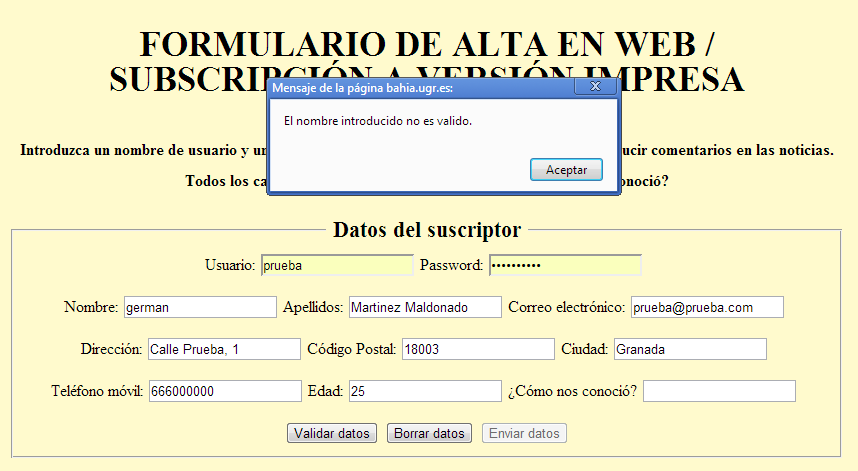

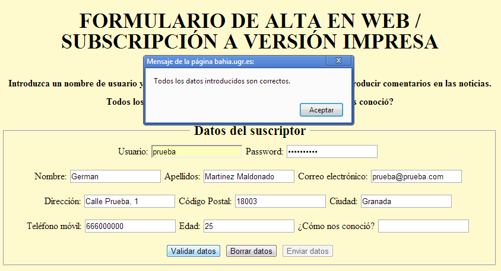

El guión que reciba los valores del formulario, lo primero que hará es comprobar que todos los campos obligatorios han sido introducidos con la función `isset($_POST[“nombreCampo”])`, si por algún motivo alguno no hubiera tuviera su valor correspondiente, mostraríamos en pantalla un mensaje de error, en caso de que todos los campos tengan su valor correspondiente, primero comprobaremos que no existe ya un usuario registrado con ese mismo nombre de usuario o correo electrónico (haciendo una consulta SELECT que devuelve si existe algún registro coincidente), sino existe llamamos a la función de usuario de insertar usuarios (una consulta INSERT INTO en este caso).


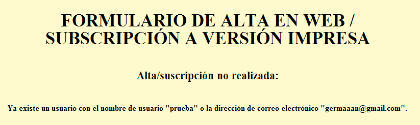

### Gestión de sesiones

Como que queremos los usuarios registrados puedan acceder a la web con su nombre de usuario y contraseña, en la portada de la web vamos a incluir una pequeño formulario que permita hacer esto, este formulario le pasara los datos introducidos al guión PHP **“login.php”**, que comprobará con el método **“isset”** si se han recibido mediante POST el nombre de usuario y contraseña, en caso afirmativo, llamará al método de la clase Usuario **“accesoLogueo”** para comprobar que ese par usuario-contraseña pertenecen a un usuario registrado, iniciando una sesión con **“sesión_start()”** y almacenando en la variable global **“$_SESSION[‘usuario’]”** el nombre de usuario que ha iniciado la sesión; tanto si el usuario existe como si no, usaremos la función **“header”** para volver a la portada de la web.

Una vez logueados con éxito, no nos interesa que se vuelva a mostrar el formulario de acceso, por lo que haremos que el formulario de acceso solo se muestre si la variable **“$_SESSION[‘usuario’]”** no está declarada, en caso de que esté declarada, mostraremos el nombre completo del usuario que ha iniciado sesión y un enlace que nos permitirá cerrar la sesión. Este enlace lanzará un guión PHP que simplemente mediante la función **“unset($_SESSION[‘usuario’])”** elimina el valor almacenado de la sesión actual y con el método **“session_destroy()”** destruye la sesión actual, después de esto vuelve a la portada de la web.

En las siguientes imágenes podemos ver las dos opciones comentadas:

* Sin usuario identificado:

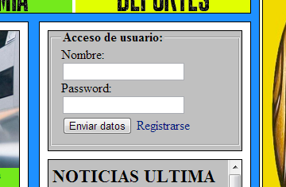

* Con usuario identificado:

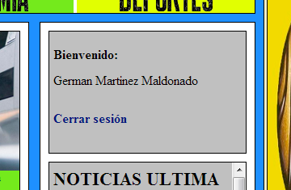

### Gestión de comentarios

Vamos también a implementar un formulario para que el usuario pueda introducir noticias en las noticias, para ello en la sección que teníamos de **“OPINIONES DE LOS LECTORES”** eliminamos la lista que insertamos en la práctica anterior, y en su lugar insertamos un formulario que al mostrarse por pantalla mostrará un etiqueta de texto con el nombre de usuario del usuario que tenga una sesión abierta actualmente (en caso de ser un usuario no registrado, podrá comentar bajo el usuario **“USUARIO NO REGISTRADO”**), un campo de texto que nos permite introducir hasta 255 caracteres (que con JavaScript comprobamos que nunca se acepte un comentario vacío o con una longitud superior a 200 caracteres), y los botones de validar el comentario, borrarlo y enviarlo, que llamarán a las funciones JavaScript correspondientes cuando sean pulsados. Además el formulario también contendrá una serie de campos ocultos: un campo con el propio nombre de usuario, otro con el nombre de la noticia (así cuando recuperemos las noticias de la base de datos, podremos saber a qué noticia pertenece cada comentario) y otro campo con la ruta de acceso al archivo de la noticia para volver una vez el comentario ha sido introducido, además saltando a una etiqueta `<p>` que hemos incluido para que se incluya justo después del último comentario leído.

Todos los valores de estos campos son pasados al guión **“insertaComentario.php”**, que comprueba que todos los campos han sido rellenados, e introduce el comentario en la base de datos llamando a la función **“insertarComentario”** de la clase **“Comentario”**. A destacar, que se insertarán además dos valores en cada registro correspondiente a un comentario que nunca le pasaremos, un identificador número para la noticia, que se incluirá como un campo número que se autoincrementa; y para insertar la fecha se usará **“CURRENT_TIMESTAMP”**, que devuelve la hora actual en el sistema.

Para mostrar las noticias, usaremos el método de **“Comentario”** **“getComentarios”**, que nos devolverá todos los comentarios obtenidos mediante una consulta SELECT que coincidan con el nombre de la noticia que le pasamos como parámetro, el resultado obtenido de esta función, se lo pasamos a la función **“mostrarComentarios”** que irá incluyendo todas las noticias recibidas, una a una, en una lista desordenada.

Ejemplo de la introducción de comentarios en una noticia cualquiera:

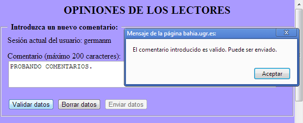

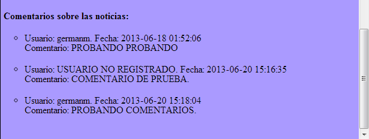

### Usuario “admin”

Tiene que existir un usuario **“admin”** que será el encargado de gestionar las noticias de última hora, borrando, actualizándolas o añadiendo nuevas. Para ello, vamos a añadir a la  portada  de nuestra web, que si hay una sesión iniciada por un usuario con nombre de usuario **“admin”** se nos mostrará en la zona entre donde está el formulario de acceso y las noticias de última hora, un apartado que nos permitirá seleccionar la acción que queremos efectuar sobre las noticias de última hora: Añadir, Actualizar o Borrar, seleccionando la opción correspondiente y pulsando el botón **“Realizar acción”** para que nos lleve a la página de gestión.

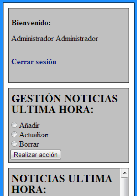

La página de gestión de noticias es el guión **“gestión.php”**, para acceder a los apartados de gestión de noticias tiene que haber una sesión de usuario iniciada y además está tiene que ser del usuario **“admin”**. La particularidad de esta página, es que la página siempre es la misma, pero en función de la opción seleccionada (comprobado con un **“if”**) en el menú de la portada de la web, está mostrará la sección de adición de noticias, la sección de actualización de noticias o la sección de borrado de noticias.

La sección de adición de noticias simplemente mostrará un campo de texto para que introduzcamos la noticia a insertar y un botón para enviar dicha noticia, esto llamará al guión **“insertaNoticia.php”** que después de comprobar que es el usuario **“admin”** quien debe haber introducido  un  texto  en  el  formulario,  llamara  a  la  función  **“insertarNoticia”**  de  la  clase **“NoticiaUltimaHora”**,  esta  función  simplemente  ejecuta  una  consulta  **“INSERT  INTO”**  para introducir  la  noticia  en  la  base  de  datos,  lo  que  no  le  pasamos  es  el  campo  numérico autoincremental que le asignará un identificador número por el que la noticia será reconocida.

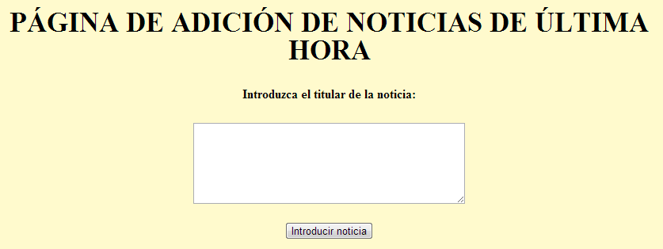

La sección de actualización de noticias, mostrará mediante el método **“mostrarNoticiasAvanzado”** de la clase **“NoticiaUltimaHora”** en una lista desordenada todas las noticias de última hora recuperadas de la base de datos mediante el método **“getNoticiasUltimaHora”**, disponiendo de un campo para introducir el identificador de la noticia a modificar y otro campo para introducir el nuevo texto de la noticia. Cuando pulsemos el botón **“Actualizar noticia”** este le pasará la información del formulario al guión **“actualizaNoticia.php”**, que hará un acción muy parecida al caso de insertar noticias, pero usando en este caso un método con una consulta **“UPDATE”**.

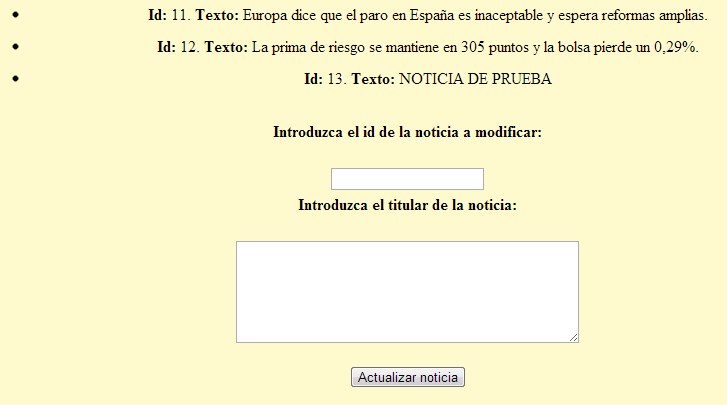

Por última la sección de borrar tendrá un aspecto casi similar a la sección de actualizar, pero solo mostrando un campo para introducir el identificador de la noticia a borrar, para cuando se pulse el botón **“Borrar noticia”** pasarle dicho valor a al guión **“eliminaNoticia.php”** que llamará a la función **“eliminarNoticia”**, que ejecutará una consulta **“DELETE”** que coincida con el identificador recibido como parámetro.

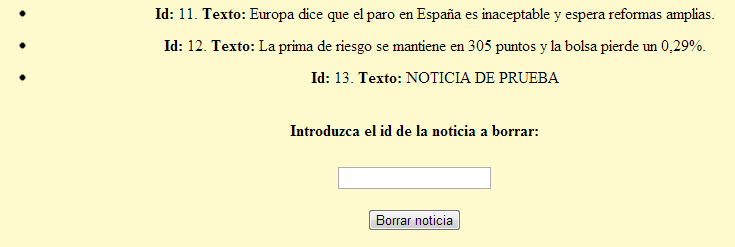

Para que las noticias de última hora mostradas en portada siempre estén actualizadas, cada vez que se cargue la página, para mostrar las noticias de última hora se llamará a la función **“mostrarNoticias”** a la  que pasaremos como  parámetro una llamada a la  función **“getNoticiasUltimaHora”** que será la que obtenga todas las noticias de última hora existentes en ese mismo momento en la base de datos, la primera función lo único que hace es ir insertando cada una de esas noticias en una lista desordenada. Así mantenemos el aspecto de la sección de noticias de última hora de la versión anterior del periódico, pero con la gran diferencia de que estas ahora están siendo cargadas de forma dinámica mediante PHP cada vez que se actualice la página.

### Ventanas emergentes con noticias relacionadas

El último punto que se pedía desarrollar, era que cuando el ratón pase por encima del titular de una noticia desarrollada, aparecerá una ventana emergente con las noticias relacionadas de esa noticia. Para empezar, en nuestra página web los titulares están introducidos en etiquetas `<h2>`, y el evento que gestiona el pasar por encima con el ratón es `onmouseover`, por lo que tenemos que hacer introducir el evento `onmouseover` para que llame a una función JavaScript cada vez que el ratón pase por encima de `<h2>` de ese titular, un ejemplo de cómo quedaría podría ser:

```
<h2 onmouseover="ventanaNoticiasRelacionadas(1)"> NACIONAL. Interior admite que ya "se vislumbra el final" de ETA pero pide no cantar victoria </h2>
```

Para que no obtengamos el molesto comportamiento de que se nos estén constantemente abriendo ventanas emergentes, creamos una variable cuyo valor es un valor numérico que representa si para una determinada noticia, ha sido ya abierta una ventana emergente, para si este es el caso, no vuelva a abrir dicha ventana emergente hasta que actualicemos la página. La función a la que indicamos que vamos a llamar, primero comprobará que no se haya abierta ninguna ventana emergente de esa noticia, y si es así indica la página que debe cargarse en dicha ventana emergente en función de la sección de la noticia, haciendo después una llamada a **“windows.open”** a la que le pasamos la ruta de la página a cargar en la ventana y diversos parámetros más, que también son configurables. Un ejemplo de la llamada sería:

```
window.open(ruta,'','"channelmode=no,directories=no,fullscreen=no,height=482,width=539,location=no,menubar=no,resizable=no,scrollbars=no,status=no,left=600,top=80"');
```

Como decíamos esto hará que una ventana emergente se abra, cargando la página que le hayamos indicado en función de a que sección pertenezca la noticia. Esa página siempre tendrá el titular de las noticias relacionadas y los enlaces a las mismas, pero no nos interesa que al pulsar el enlace en la ventana emergente, se cargue la página en la ventana emergente, lo que nos interesa es que se cargue en la ventana que teníamos ya abierta; para poder hacer esto, haremos que cuando se pulse los enlaces de las ventanas emergente se llame a un función que primero cargue la página del enlace en la ventana principal haciendo uso del objeto **“windows.opener”**, que referencia a la ventana que abrió la ventana actual (`window.opener.location.href = enlace`) y después que cierre la ventana actual (`window.close()`).


