Seguridad y Protección de Sistemas Informáticos
===============================================
4º Grado en Ingeniería Informática 2013/2014
--------------------------------------------


# Práctica 3: La herramienta Cryptool. Uso de herramientas con cifrados clásicos.
### Germán Martínez Maldonado

## 4. Escoger 3 métodos distintos de cifrado simétrico clásico y comprender como cifran. Explicarlo y añadir ejemplos de textos llanos en castellano.

Los 3 métodos distintos de cifrado simétrico clásico seleccionados son **“Hill”**, **“Playfair”** y **“XOR”**.

El texto llano en castellano a usar es el primer párrafo de El Quijote, pero para evitar problemas de codificación con CrypTool hemos sustituidos todas las vocales acentuadas y la ñ:

```
EN UN LUGAR DE LA MANCHA, DE CUYO NOMBRE NO QUIERO ACORDARME, NO HA MUCHO TIEMPO QUE VIVIA UN HIDALGO DE LOS DE LANZA EN ASTILLERO, ADARGA ANTIGUA, ROCIN FLACO Y GALGO CORREDOR. UNA OLLA DE ALGO MAS VACA QUE CARNERO, SALPICON LAS MAS NOCHES, DUELOS Y QUEBRANTOS LOS SABADOS, LENTEJAS LOS VIERNES, ALGUN PALOMINO DE ANADIDURA LOS DOMINGOS, CONSUMIAN LAS TRES PARTES DE SU HACIENDA. EL RESTO DELLA CONCLUIAN SAYO DE VELARTE, CALZAS DE VELLUDO PARA LAS FIESTAS CON SUS PANTUFLOS DE LO MISMO, LOS DIAS DE ENTRE SEMANA SE HONRABA CON SU VELLORI DE LO MAS FINO. TENIA EN SU CASA UNA AMA QUE PASABA DE LOS CUARENTA, Y UNA SOBRINA QUE NO LLEGABA A LOS VEINTE, Y UN MOZO DE CAMPO Y PLAZA, QUE ASI ENSILLABA EL ROCIN COMO TOMABA LA PODADERA.
```

### Cifrado de Hill

El cifrado de Hill es un cifrado por sustitución polialfabética basado en el álgebra lineal. Lo primero que se hace es asignar un valor numérico a cada letra del alfabeto a utilizar:

| A: 01 | B: 02 | C: 03 | D: 04 | E: 05 | F: 06 | G: 07 | H: 08 | I: 09 | J: 10 | K: 11 | L: 12 | M: 13 |
|-------|-------|-------|-------|-------|-------|-------|-------|-------|-------|-------|-------|-------|
| N: 14 | O: 15 | P: 16 | Q: 17 | R: 18 | S: 19 | T: 20 | U: 21 | V: 22 | W: 23 | X: 24 | Y: 25 | Z: 26 |

Antes de cifrar debemos especificar una matriz cuadrada de la dimensión que deseemos y asignarle a cada elemento una letra, como por ejemplo:

```
H[t] = [W J E]
       [H S P]
       [C J P]
```

cuyo equivalente numérico sería

```
H[n] = [23 10 05]
       [08 19 16]
       [03 10 16]
```

Ahora para cifrar, dividimos el texto en bloques de letras que tengan la misma cantidad de letras que número de filas/columnas de la matriz; procedemos a sumar el resultado de multiplicar cada una de las letras con cada uno de los valores de la fila correspondiente, y aplicándole un módulo 26 al resultado obtenemos el valor codificado.

Como usamos una matriz de 3x3 el primer bloque a cifrar sería **“ENU”** cuyos valores numéricos serían **“05 14 21”**. Procedemos a la codificación:

* E: 05 → 23*05 + 10*14 + 05*21 (mod 26) = 22: V 
* N: 14 → 08*05 + 19*14 + 16*21 (mod 26) = 18: R 
* U: 21 → 03*05 + 10*14 + 16*21 (mod 26) = 23: W

Así obtenemos que nuestro primer bloque **“ENU”** una vez cifrado es **“VRW”**, quedando todo el texto cifrado de la siguiente manera:

```
VR WA ZDAYG TG TB KSBKRJ, HS NQUN BISNIR ZE VCOFXS XSMQBFWCD, RE HX SAPZQ CUVNXW BQC DWNJK IE RFFIFSO AX NKH VU RAJIU LK SRLCDZKJK, UODTIY QCMABKG, WDIKZ BHXSM Z KEEAH WYEPQLFR. OQG FKBP QM ZEAH NKO KITL QOT IIGVNIE, NOXOZEKE RVZ YUB HURVMJ, RQXNKR O GWIOZWBCUT AIV OUUHLWJ, RWAZJWMF AIV WKBGVNM, YYYCM VAPZQGXS VMWODTEBQPJ HYF ZYQEOPUG, CMSJEGACA QCL OJHD DYOFVH VU KC ETAUOFKC. IK MWRFO NIROX SMVWDFQMW UNQC CV RCLMVEQ, BMBSYQ WV RCGJXJA BZBQ QCL SMFRBMV GOS CVD DYCVFUVNH VU WQ DTQIT, POB HGYQ WA UCOJH FMCLDC GK ACXEVJM CMS CS UIROXHE TG TL SIV TAZO. RNHMM OQ LA CJUA DHK BKS BQC EIXVJM TG TDI WKGWQBGN, M QKS RMDONPA BQC LQ TWQPVJM J HYF ZSEHSB, S CG AVNK FT IINXW O TKBXS, BQC XSY LLQWXAVJM MJ GDIKK SZCG OLSILS ZX FMRKHNHC.
```

### Cifrado de Playfair

El cifrado de Playfair consiste en convertir un par de letras de un texto sin codificar a otro par distinto para obtener un texto codificado. La clave vendrá dada por una matriz de 5x5 caracteres, colocando en la primera fila de la matriz la palabra clave sin letras repetidas. Por ejemplo, si SUGAR es la palabra clave la matriz clave sería:

```
[ S U G A R ]
[ B C D E F ]
[ H I K L M ]
[ N O P Q T ]
[ V W X Y Z ]
```

Ahora agrupamos el texto en parejas de 2 letras (a las que nos referiremos en cada caso como L1 y L2) y vamos codificando siguiendo las siguientes reglas:

* Si L1 y L2 están en la misma fila en la matriz clave, codificarlos como las letras que estén a su derecha (la derecha de la última letra será la primera por la izquierda)
* Si L1 y L2 están en la misma columna en la matriz clave, codificarlos como las letras que estén debajo (debajo de la última letra será la primera por arriba)
* Si L1 y L2 están en distinta fila y columna, codificarlos como la letra de la misma fila que se encuentre en la misma columna que la otra letra de la pareja.
* Si L1 y L2 son iguales, insertar X como carácter sin significado, solo para separador.
* Si el número de letras es impar, se introducirá una X al final para que sean pares.

Así para codificar las primeras parejas de nuestro texto (EN UN LU GA) seguiríamos el siguiente procedimiento:

* EN: E y N están en distinta fila y columna, por lo que E se codifica como la letra que este en la misma columna que N, en este caso B, siguiendo el mismo proceso para codificar N como Q.
* UN: mismo caso que el anterior, U pasa a ser S y N pasa a ser O.
* LU: mismo caso que el anterior, L pasa a ser I e U pasa a ser A.
* GA: están en la misma fila, por lo que G pasa a ser la letra de su izquierda (A) y A hace lo propio (R).

Con lo que obtendríamos el siguiente texto codificado:

```
BQ SO IA AR GF LQ RL SQ BI GE FD AW PO TI FS BQ PT CO FA QU IW GF RS LF OP LS IR BI PN LC KT PT AC WH WH RG VN KC EQ UP EF IQ GB LQ SQ YR BQ RU OM KY QL UT GE RS AR SQ OM AG RS WI HO EM UE QW AR KA WI TU AF CP SG QS QI QE EF EQ UP LR BS UE EY AC EU ST FA NU EQ OK IW QH RU LR BV WI LB GB AC IQ AV OA FC SR ON NU IQ GV UR ES CP AH BQ QF LU AH NU WH FA QB UR KA SO QG IQ HK OP EF SQ GE KC GS EQ NU CP HK PS NU IW VB RI LU QH RU ZF BA QG FZ BA EF UG LS IO BQ EG LQ AF RN PC LQ QE IW OB IA LU VB EA PC BY LQ RS QF EU MY RU EF YB KY IA CP QG SR QE RB LC RN RU IW VB GU QG ON RC IQ GB LQ TI HU IT IQ GB LU GB DY BQ ZF BA FL SQ RU BL PO SR ES IW VB SW LQ IQ UM EF IQ LR RB HO PN BQ LU BQ UG EU UR SO GY RL EY AC QG UR ES EF IQ UB GR AF ON EA SO RU NC UM QS OA BQ QI QL AR ES EQ NU YB HO QF WA TH TW PC FD RL QP XQ QE YR OA LE UH BQ UH KY QE ES LQ UT IO OB TI PN TI SE EQ GQ PC GE FA GY
```

### Cifrado XOR

El cifrado XOR es un algoritmo de cifrado basado en el operador binario XOR (eXclusive OR), un tipo de disyunción lógica de dos operandos que obtendrá como resultado **“verdadero”** si solo un operando es verdad, pero no ambos:

* A ⊕ 0 = A
* A ⊕ A = 0
* (B ⊕ A) ⊕ A = B ⊕ 0 = B

Para cifrar un texto con XOR, primero deberemos especificar una clave, como podría ser **“343AAA”**, el cifrado consistirá en aplicar el operador de bit XOR a cada uno de las letras del mensaje.

Una vez codificado el texto, el resultado obtenido sería el siguiente conjunto de valores hexadecimales:

```
71 74 8A 61 74 8A 78 6F ED 75 68 8A 70 7F 8A 78 7B 8A 79 7B E4 77 72 EB 18 1A EE 71 1A E9 61 63 E5 14 74 E5 79 78 F8 71 1A E4 7B 1A FB 61 73 EF 66 75 8A 75 79 E5 66 7E EB 66 77 EF 18 1A E4 7B 1A E2 75 1A E7 61 79 E2 7B 1A FE 7D 7F E7 64 75 8A 65 6F EF 14 6C E3 62 73 EB 14 6F E4 14 72 E3 70 7B E6 73 75 8A 70 7F 8A 78 75 F9 14 7E EF 14 76 EB 7A 60 EB 14 7F E4 14 7B F9 60 73 E6 78 7F F8 7B 16 8A 75 7E EB 66 7D EB 14 7B E4 60 73 ED 61 7B 86 14 68 E5 77 73 E4 14 7C E6 75 79 E5 14 63 8A 73 7B E6 73 75 8A 77 75 F8 66 7F EE 7B 68 84 14 6F E4 75 1A E5 78 76 EB 14 7E EF 14 7B E6 73 75 8A 79 7B F9 14 6C EB 77 7B 8A 65 6F EF 14 79 EB 66 74 EF 66 75 86 14 69 EB 78 6A E3 77 75 E4 14 76 EB 67 1A E7 75 69 8A 7A 75 E9 7C 7F F9 18 1A EE 61 7F E6 7B 69 8A 6D 1A FB 61 7F E8 66 7B E4 60 75 F9 14 76 E5 67 1A F9 75 78 EB 70 75 F9 18 1A E6 71 74 FE 71 70 EB 67 1A E6 7B 69 8A 62 73 EF 66 74 EF 67 16 8A 75 76 ED 61 74 8A 64 7B E6 7B 77 E3 7A 75 8A 70 7F 8A 75 74 EB 70 73 EE 61 68 EB 14 76 E5 67 1A EE 7B 77 E3 7A 7D E5 67 16 8A 77 75 E4 67 6F E7 7D 7B E4 14 76 EB 67 1A FE 66 7F F9 14 6A EB 66 6E EF 67 1A EE 71 1A F9 61 1A E2 75 79 E3 71 74 EE 75 14 8A 71 76 8A 66 7F F9 60 75 8A 70 7F E6 78 7B 8A 77 75 E4 77 76 FF 7D 7B E4 14 69 EB 6D 75 8A 70 7F 8A 62 7F E6 75 68 FE 71 16 8A 77 7B E6 6E 7B F9 14 7E EF 14 6C EF 78 76 FF 70 75 8A 64 7B F8 75 1A E6 75 69 8A 72 73 EF 67 6E EB 67 1A E9 7B 74 8A 67 6F F9 14 6A EB 7A 6E FF 72 76 E5 67 1A EE 71 1A E6 7B 1A E7 7D 69 E7 7B 16 8A 78 75 F9 14 7E E3 75 69 8A 70 7F 8A 71 74 FE 66 7F 8A 67 7F E7 75 74 EB 14 69 EF 14 72 E5 7A 68 EB 76 7B 8A 77 75 E4 14 69 FF 14 6C EF 78 76 E5 66 73 8A 70 7F 8A 78 75 8A 79 7B F9 14 7C E3 7A 75 84 14 6E EF 7A 73 EB 14 7F E4 14 69 FF 14 79 EB 67 7B 8A 61 74 EB 14 7B E7 75 1A FB 61 7F 8A 64 7B F9 75 78 EB 14 7E EF 14 76 E5 67 1A E9 61 7B F8 71 74 FE 75 16 8A 6D 1A FF 7A 7B 8A 67 75 E8 66 73 E4 75 1A FB 61 7F 8A 7A 75 8A 78 76 EF 73 7B E8 75 1A EB 14 76 E5 67 1A FC 71 73 E4 60 7F 86 14 63 8A 61 74 8A 79 75 F0 7B 1A EE 71 1A E9 75 77 FA 7B 1A F3 14 6A E6 75 60 EB 18 1A FB 61 7F 8A 75 69 E3 14 7F E4 67 73 E6 78 7B E8 75 1A EF 78 1A F8 7B 79 E3 7A 1A E9 7B 77 E5 14 6E E5 79 7B E8 75 1A E6 75 1A FA 7B 7E EB 70 7F F8 75 14 A0
```

Que en texto plano equivaldría a:

```
qtŠatŠxoíuhŠp.Šx{Šy{äwrë..îq.éacå.tåyxøq.ä{.ûasïfuŠuyåf~ëfwï..ä{.âu.çayâ{.þ}.çduŠeoï.lãbsë.oä.rãp{æsuŠp.Šxuù.~ï.vëz`ë..ä.{ù`sæx.ø{.Šu~ëf}ë.{ä`sía{†.håwsä.|æuyå.cŠs{æsuŠwuøf.î{h„.oäu.åxvë.~ï.{æsuŠy{ù.lëw{Šeoï.yëftïfu†.iëxjãwuä.vëg.çuiŠzué|.ù..îa.æ{iŠm.ûa.èf{ä`uù.våg.ùuxëpuù..æqtþqpëg.æ{iŠbsïftïg.ŠuvíatŠd{æ{wãzuŠp.Šutëpsîahë.våg.î{wãz}åg.Šwuägoç}{ä.vëg.þf.ù.jëfnïg.îq.ùa.âuyãqtîu.ŠqvŠf.ù`uŠp.æx{Šwuäwvÿ}{ä.iëmuŠp.Šb.æuhþq.Šw{æn{ù.~ï.lïxvÿpuŠd{øu.æuiŠrsïgnëg.é{tŠgoù.jëznÿrvåg.îq.æ{.ç}iç{.Šxuù.~ãuiŠp.Šqtþf.Šg.çutë.iï.råzhëv{Šwuä.iÿ.lïxvåfsŠp.ŠxuŠy{ù.|ãzu„.nïzsë..ä.iÿ.yëg{Šatë.{çu.ûa.Šd{ùuxë.~ï.våg.éa{øqtþu.Šm.ÿz{Šguèfsäu.ûa.ŠzuŠxvïs{èu.ë.våg.üqsä`.†.cŠatŠyuð{.îq.éuwú{.ó.jæu`ë..ûa.Šuiã..ägsæx{èu.ïx.ø{yãz.é{wå.nåy{èu.æu.ú{~ëp.øu.
```


## 5. Realizar un análisis del cifrado con Entropía, Histogramas, Frecuencias y N-gramas. Calcular la Autocorrelación y la Periodicidad.

### Cifrado de Hill

* **Entropía**: Este documento contiene los 26 caracteres diferentes del alfabeto seleccionado. La entropía del documento es 4.65 (la entropía máxima posible es 4.70). Como el valor de la entropía es casi como el máximo posible, estamos ante un sistema con un grado alto de seguridad.

* **Histogramas**: Los caracteres con una mayor frecuencia de aparición son C, Q, K, M, V, S. Que vemos que están contenidas en muchas palabras, pero no necesariamente juntas.

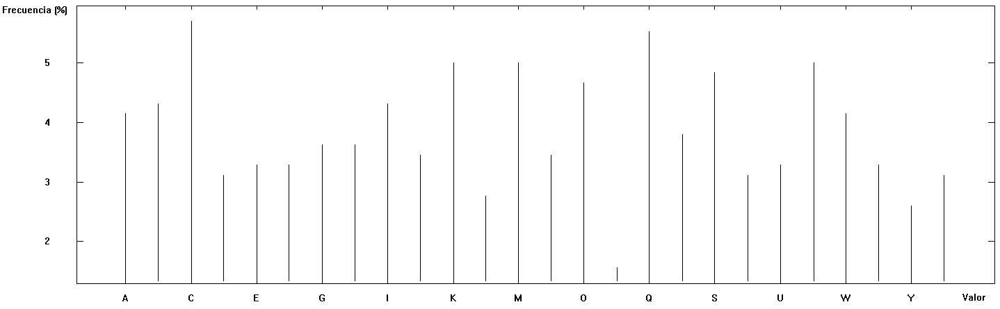

* **Frecuencias**: Hay un mayor número de caracteres diferentes por bloque cuando se produce un desplazamiento de en torno a 270. La línea no es nada plana, lo que nos indica que es posible que no sea excesivamente difícil descifrar el texto.

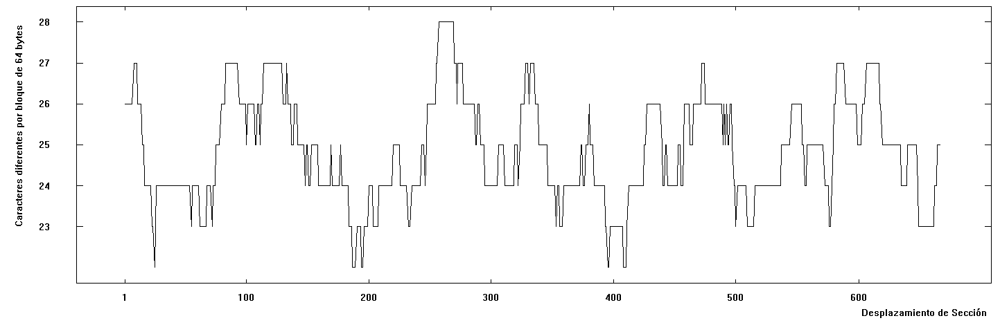

* **N-gramas**: Nuestra clave cifra en bloques de 3 letras, pero no vemos un trigrama que se repita las suficientes veces como para lo suficientemente característico y, que nos sea de ayuda a la hora de descifrar el texto.

| Nº | Subcadena | Frecuencia (en %) | Frecuencia |
|:--:|:---------:|:-----------------:|:----------:|
|  1 |    BQC    |       1.2698      |      4     |
|  2 |    VJM    |       1.2698      |      4     |
|  3 |    AIV    |       0.6349      |      2     |
|  4 |    APZ    |       0.6349      |      2     |
|  5 |    CMS    |       0.6349      |      2     |
|  6 |    DIK    |       0.6349      |      2     |
|  7 |    EAH    |       0.6349      |      2     |
|  8 |    GVN    |       0.6349      |      2     |
|  9 |    HYF    |       0.6349      |      2     |
| 10 |    IRO    |       0.6349      |      2     |

* **Autocorrelación**: el número de caracteres que concuerdan es muy alto en desplazamientos de alrededor a 21, 30, 42 o 51, lo que nos podría indicar que estos números son múltiplos de la longitud de la clave.

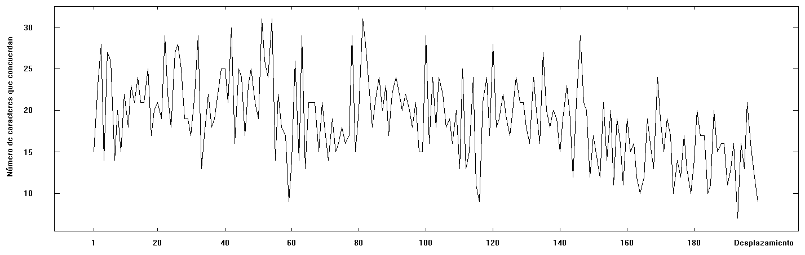

* **Periodicidad**: No se ha encontrado periodicidad, por lo que no hay secuencias que se repitan con cierta asiduidad durante el texto.

### Cifrado Playfair:

* **Entropía**: Este documento contiene 25 caracteres diferentes del alfabeto seleccionado. La entropía del documento es 4.33 (la entropía máxima posible es 4.70). El valor de la entropía no llega a ser tan alto como en el cifrado de Hill, pero se puede seguir considerando bueno.

* **Histogramas**: La letra que más se repite de la Q, y lejos, U, E, B, R. Destacar que Q, aparece mucho a lo largo que el texto.

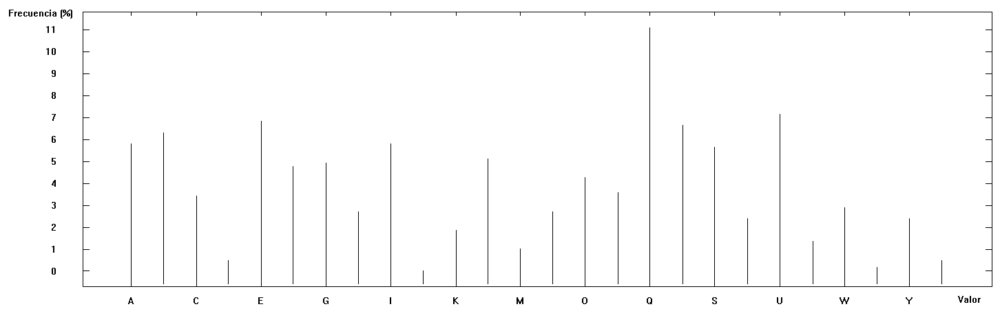

* **Frecuencias**: El mayor número de caracteres diferentes por bloque se produce ahora con un desplazamiento bastante menor, solo 100; además en conjunto con que la línea no es nada plana, puede significar también que la codificación no sea muy complicado de descifrar.

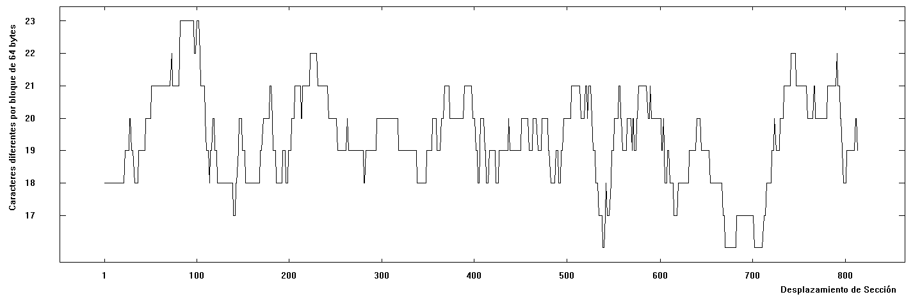

* **N-gramas**: En un texto más pequeño, es posible que pudiéramos considerar que se repitan con la frecuencia indicada algunos bigramas, pero no en este caso, lo que si coincide es que la letra Q sigue apareciendo una gran cantidad de veces.

| Nº | Subcadena | Frecuencia (en %) | Frecuencia |
|:--:|:---------:|:-----------------:|:----------:|
|  1 |     BQ    |       3.4130      |     10     |
|  2 |     IQ    |       3.0717      |      9     |
|  3 |     LQ    |       2.7304      |      8     |
|  4 |     EF    |       2.3891      |      7     |
|  5 |     RU    |       2.3891      |      7     |
|  6 |     EQ    |       2.0478      |      6     |
|  7 |     IW    |       2.0478      |      6     |
|  8 |     NU    |       2.0478      |      6     |
|  9 |     ES    |       1.7065      |      5     |
| 10 |     GB    |       1.7065      |      5     |

* **Autocorrelación**: El número de caracteres que coinciden es muy alto cada par de valores, este periodo puede indicar que la longitud de la llave de cifrado sea corta.

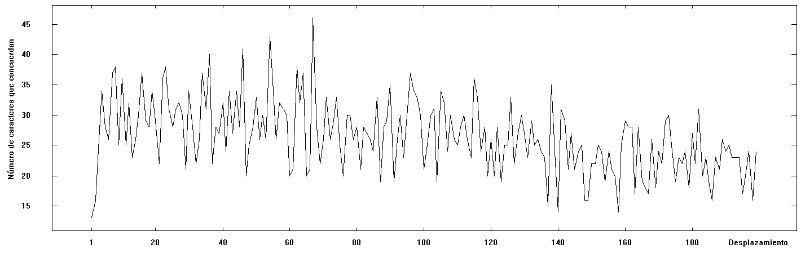

* **Periodicidad**: No se ha encontrado periodicidad, por lo que no hay secuencias que se repitan con cierta asiduidad durante el texto.

### Cifrador XOR:

* **Entropía**: Este documento contiene 59 valores (byte) diferentes (existen 256 (byte) diferentes). La entropía del documento es 5.30 (la entropía máxima posible es 8.00). En este caso es valor es el más bajo, por lo que quizás no nos encontremos ante un sistema de tan bueno.

* **Histogramas**: Los valores aproximados de 21, 27, 119, 123 y 138 son muy altos, por lo que sus valores hexadecimales correspondientes (si fueran esos valores exactos): 15, 1B, 77, 7B y 8A, respectivamente; deberían aparecer varias veces en el archivo hexadecimal con el texto cifrado.

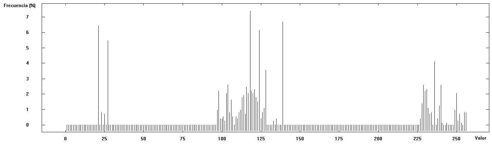

* **Frecuencias**: El mayor número de caracteres diferentes por bloque se produce en varios puntos del gráfico y la línea no es nada plana, otra codificación no muy complicado de descifrar aparentemente.

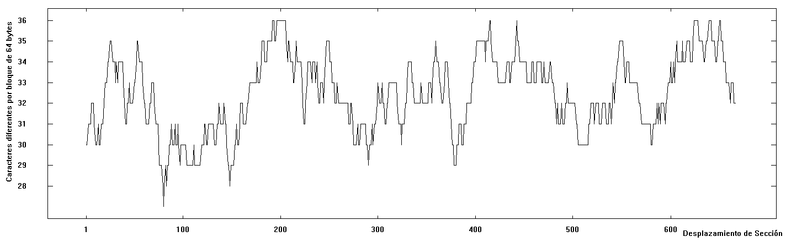

* **N-gramas**: tenemos los bigramas en texto plano equivalentes a los valores hexadecimales obtenidos de los codificados, ninguno tiene una frecuencia significativa para la longitud del texto.

| Nº | Subcadena | Frecuencia (en %) | Frecuencia |
|:--:|:---------:|:-----------------:|:----------:|
|  1 |     QT    |       5.9524      |      5     |
|  2 |     WU    |       5.9524      |      5     |
|  3 |     AT    |       4.7619      |      4     |
|  4 |     UI    |       4.7619      |      4     |
|  5 |     XV    |       4.7619      |      4     |
|  6 |     ZU    |       4.7619      |      4     |
|  7 |     SU    |       3.5714      |      3     |
|  8 |     UY    |       3.5714      |      3     |
|  9 |     XU    |       3.5714      |      3     |
| 10 |     BS    |       2.3810      |      2     |

* **Autocorrelación**: Aparentemente no se aprecia un número de caracteres coincidentes cada cierto número de desplazamientos que pudiera indicar un posible periodo o múltiplo.


* **Periodicidad**: No se ha encontrado periodicidad, por lo que no hay secuencias que se repitan con cierta asiduidad durante el texto.

## 6. Describir la llave que usa cada sistema, la Distancia de Unicidad (número total de llaves posibles) y las ventajas e inconvenientes del mismo.

### Cifrado de Hill

Usa una llave compuesta por una matriz cuadrada de caracteres, dichos caracteres son todos los del alfabeto y pueden estar repetidos, tienen a su vez un equivalente numérico; siendo estos valores numéricos los que multiplicados de forma secuencial (tanto por filas como por columnas), codificarán el texto siguiendo el procedimiento explicado en el primer punto de la práctica.

El número total de llaves posibles es 26 (posibles caracteres) elevado a n (dimensión de la matriz), menos las claves que no puedan invertirse en módulo 26, ya que estas nos impedirían cifrar y descifrar el mensaje correctamente.

Las ventajas de este tipo de llave es que al hacerse los cifrados en bloque, si hacemos los bloques lo suficientemente grandes, será difícil descifrar textos cifrados pequeños mediante análisis estadístico porque no se tendrá suficientes componentes para generar la clave.

El inconveniente se encuentra precisamente en que al aumentar el tamaño del bloque a cifrar, aumenta rápidamente el tamaño de la clave al ser matrices cuadradas: 2x2, 3x3, 4x4, 5x5...

### Cifrado de Playfair:

La llave es una matriz cuadrada de caracteres que tiene un tamaño de 5x5 o 6x6, dicha matriz se utiliza para codificar el mensaje usando el procedimiento en función del posicionamiento del carácter a codificar descrito en la primera parte de la práctica. La primera fila de la matriz será una palabra clave, el resto de la matriz serán los caracteres del alfabeto no usados en la palabra clave ordenados de forma ascendente.

El número total de llaves posibles viene dado por el tamaño de la matriz, ya que los elementos no se pueden repetir, así que será de un longitud de 25 en el caso de una matriz de 5x5 y de 36 en el caso de una matriz de 6x6.

Las ventajas de esta llave son, que al igual que con el cifrado anterior, el cifrado en bloque hace más difícil que se pueda sacar la clave mediante análisis estadístico; además, en este tipo de cifrado solo es necesario memorizar la palabra clave, no la matriz al completo.

El inconveniente es que si por la repetición de bloques se extrae un patrón que permita determinar la clave, ya que en este caso el tamaño de la llave no varía, si se conoce la clave, el texto sería fácilmente descodificado.

### Cifrado XOR:

La llave es una cadena de caracteres hexadecimales que serán usados para codificar cíclicamente los caracteres del texto a cifrar mediante la realización de la operación de bit XOR.

El número total de llaves será 2048 (longitud máxima de clave por) elevado a 16 (caracteres hexadecimales), siendo un total de 9’578 * 1052 llaves.

La principal ventaja de esta clave es que simple de utilizar y su funcionamiento es muy rápido, ya que necesita muy pocos recursos informáticos en comparación con otros sistemas cifrado más complejos. Además que con el gran número de claves posibles, un ataque por fuerza bruta no es factible, lo que aumenta la seguridad en ese sentido.

El inconveniente de esta clave, es que al haber un número tan alto de claves es posible que están sean difícil de gestionar, lo que puede hacer el sistema vulnerable a un ataque mediante diccionario, donde el atacante puede encontrar una coincidencia y obtener la palabra usada como clave.

## 7. Generar dos ficheros de llaves, uno de Enigma98 y otro con TrueCrypt. Calcular los análisis de aleatoriedad dados por CrypTool. Hacer una batería de pruebas y una visualización 3D.

Los diferentes test a realizar dentro del análisis de aleatoriedad que vamos a aplicar sobre los dos ficheros de llaves son los siguientes:

* **Test de Frecuencias**: comprueba la distribución uniforme de los valores generados por un generador de números pseudoaleatorios.
* **Test de Póker**: divide el contenido en conjuntos de 4 bits como si fuera una mano de póker, buscando fallos de aleatoriedad.
* **Test de Rachas**: analiza cuantas sucesiones de 0 o 1 seguidos hay repetidos en el contenido.
* **Test de Series**: examina si los pares de números consecutivos se distribuyen por igual, comprobando su independencia uno del otro.
* **Batería de Pruebas FIPS PUB-140-1**: es una prueba estandarizada de número aleatorios, consta de 4 pruebas individuales. Examina exactamente 2.500 bytes, no examinando documentos más cortos y solo examinando los primeros 2.500 bytes de archivos más grandes. Las pruebas se realizan sobre una secuencia binaria de 20.000 bits generada por un generador de números pseudoaleatorios, si se falla una prueba se falla el test completo. Las pruebas a realizar son las siguientes:
 * **Test de Monobit**: cuenta el número de bits iguales a uno.
 * **Test de Póker**: igual que el test individual del mismo nombre.
 * **Test de Rachas**: igual que el test individual del mismo nombre.
 * **Test de Rachas Largas**: consiste en analizar rachas al igual que el test de Rachas, pero para superarlo ninguna racha puede ser superior en longitud a 26.

* **Visualización 3D**: Permite realizar una representación gráfica de la aleatoriedad del archivo que se está analizando, cuanto mayor sea la aleatoriedad menor será la densidad de puntos en el interior del cubo.

### Resultados de pruebas individuales al archivo de claves de Enigma98:

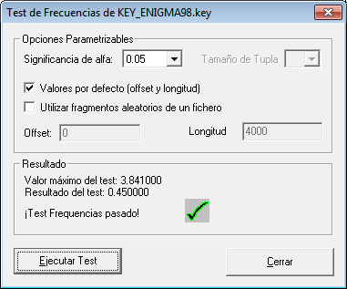
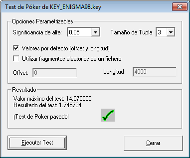
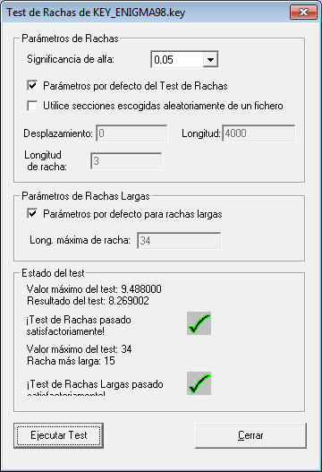
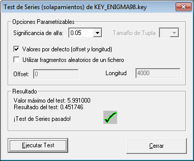

### Resultados de pruebas individuales al archivo de claves de TrueCrypt:

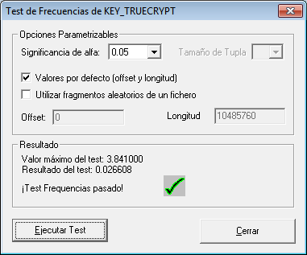
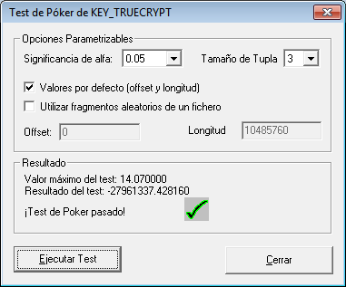
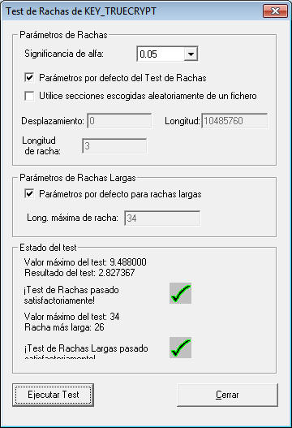
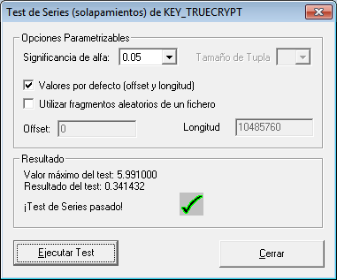

### Resultados de batería de pruebas al archivo de claves de Enigma98:

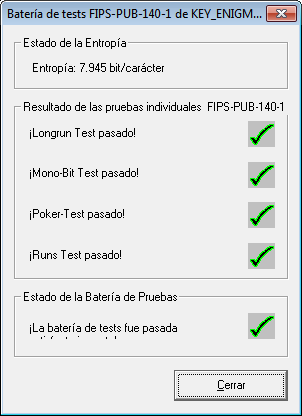

### Resultados de batería de pruebas al archivo de claves de TrueCrypt:

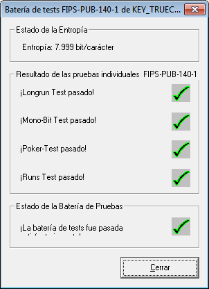

### Visualización 3D del archivo de claves de Enigma98:

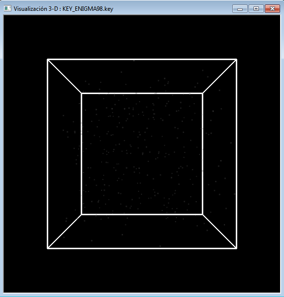

### Visualización 3D del archivo de claves de TrueCrypt:

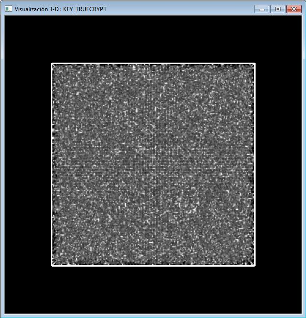
