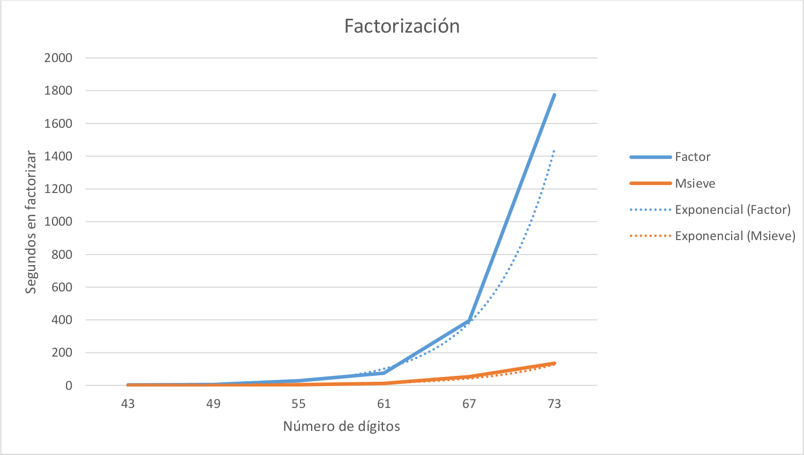

Seguridad y Protección de Sistemas Informáticos
===============================================
4º Grado en Ingeniería Informática 2013/2014
--------------------------------------------

# Práctica 4: Sistemas de Clave Pública: Simulación y ataques por factorización.
### Germán Martínez Maldonado

## 5. Evaluar cuanto tiempo emplean estos programas (y otros que eventualmente puedan conseguirse) en factorizar números en la forma p*q, donde p y q son números primos en las condiciones RSA, generados previamente con los programas antes examinados. Realizar las mediciones de tiempo para cantidades crecientes de dígitos, con números de tamaño a escoger  en función de la capacidad de los algoritmos de factorización y el tiempo empleado. Tener en cuenta que el número de dígitos para procesar en programas de propósito más general como DisMat o Fortaleza es sensiblemente inferior al de rutinas específicas como factor o Msieve. Incrementar progresivamente el número de dígitos en función de la respuesta del ordenador sobre el que se ejecute.

Los programas que se ha planteado usar para realizar la evaluación del tiempo en factorizar los número p*q han sido: **DisMat**, **Fortaleza de Cifrados** y **ExpoCrip**, con interfaz gráfica; y **Factor** y **Msieve**, en modo terminal.

Con los programas de interfaz gráfica han surgido varios problemas, con **DisMat** para obtener resultados considerables en tiempo (tiempos de ejecución de más de 1 segundo) es necesario usar número relativamente grandes, por lo que solo podemos usar la factorización en modo “algoritmo avanzado”, pero aun así con números de en torno a 50 dígitos empezamos a tener problemas. Ejemplo:

* p = 12345678901234567895053, q = 45276178548625491281291
* p*q = 558965162236294868160388628837461433790353423
* p: 23 dígitos, q: 23 dígitos, p*q: 45 dígitos. Factorizado en 1 segundo.

* p = 123456789012345678949751, q = 452761785486254912812799
* p*q = 55896516223629486815672457749271980431590663049
* p: 24 dígitos, q: 24 dígitos, p*q: 47 dígitos. Factorizado en 2 segundos.

* p = 1234567890123456789497221, q = 4527617854862549128127213
* p*q = 5589651622362948681564978034116516840535597975073
* p: 25 dígitos, q: 25 dígitos, p*q: 49 dígitos. Factorizado en 4 segundos.

* p = 12345678901234567894971883, q = 45276178548625491281272021
* p*q = 558965162236294868156481652422266048950010269585543
* p: 26 dígitos, q: 26 dígitos, p*q: 51 dígitos. Resultado error al factorizar.

Tanto en **Fortaleza de Cifrados** como en **ExpoCrip**, el problema ha estado en que cuando se realizaba la factorización, los tiempos resultantes que devolvía el programa eran muchas veces erróneos, lo que complica enormemente obtener los resultados con números de 25 dígitos, donde el tiempo de factorización era de entorno a los 25-30 minutos, por lo que no he podido obtener unos datos fiables como resultado de la factorización con estos programas. Desconozco porque se produce este problema, aunque quizás esté relacionado con que el procesador del ordenador es un Intel i5 multinúcleo.

Sin embargo con los programas que funcionan en modo terminal, **Factor** y **Msieve**, no he tenido ningún problema, quizás porque se trata de software específico o tal vez porque los tiempos los he podio tomar directamente del sistema. Los valores usados para realizar las pruebas han sido los siguientes:

* p = 1234567890123456789497 (22 dígitos)
* q = 4527617854862549128127 (22 dígitos)
* p*q = 5589651622362948681563714467609995920882119 (43 dígitos)

* p = 1234567890123456789497183 (25 dígitos)
* q = 4527617854862549128127179 (25 dígitos)
* p*q = 5589651622362948681564764009329767866137886236757 (49 dígitos)

* p = 1234567890123456789497123539 (28 dígitos)
* q = 4527617854862549128127123641 (28 dígitos)
* p*q = 5589651622362948681564426448200670539659768895304485499 (55 dígitos)

* p = 1234567890123456789497183159257 (31 dígitos)
* q = 4527617854862549128127179187219 (31 dígitos)
* p*q = 5589651622362948681564764961519170399006329407780279895936283 (61 dígitos)

* p = 1234567890123456789497183159257177 (34 dígitos)
* q = 4527617854862549128127179187219327 (34 dígitos)
* p*q = 5589651622362948681564764961520375491066710449346123985545497859879 (67 dígitos)

* p = 1234567890123456789497183159257177139 (37 dígitos)
* q = 4527617854862549128127179187219327183 (37 dígitos)
* p*q = 5589651622362948681564764961520376346331516167833045273207923027428869437 (73 dígitos)

Obteniendo los siguientes resultados en tiempos de ejecución de la factorización tanto para **Factor** como para **Msieve**:

|               | 43 dígitos | 49 dígitos | 55 dígitos | 61 dígitos | 67 dígitos | 73 dígitos |
|:-------------:|:----------:|:----------:|:----------:|:----------:|:----------:|:----------:|
| Tiempo Factor |   2’700 s  |   5’200 s  |  28’000 s  |  75’400 s  |  395’000 s | 1775’000 s |
| Tiempo Msieve |   0’749 s  |   1’200 s  |   3’900 s  |  11’900 s  |  53’800 s  |  135’000 s |

Podemos ver que en la última factorización, el salto de tiempo del resultado que obtenemos con Factor es considerable, y sobre todo si comparamos el salto correspondiente a Msieve. Al parecer al algoritmo de factorización de Msieve en las magnitudes actuales, no le afecta tanto el factor exponencial como al algoritmo de factorización de Factor.

## 6. Representar los datos anteriores en una gráfica, aproximándolos por funciones con variable x= número de dígitos (base 10) del número a factorizar. Realizarlo con las rutinas de factorización que sean coherentes para su comparación en función del número de dígitos factorizado. Para la aproximación  usar  software de aproximación matemática (Maxima, SAGE, GMath,…)

Teniendo en consideración los datos obtenidos e introducimos en la tabla del ejercicio anterior, obtenemos las siguientes funciones:

**Factor**
* f(43) = 2.700
* f(49) = 5.200
* f(55) = 28.00
* f(61) = 75.400
* f(67) = 395.000
* f(73) = 1775.000

**Msieve**
* f(43) = 0.749
* f(49) = 1.200
* f(55) = 3.900
* f(61) = 11.900
* f(67) = 53.800
* f(73) = 135.000

Obteniendo con dichas funciones la siguiente gráfica:

Obteniendo como funciones de aproximación de **Factor** que **y = 0’5052e^1’3264x** y de **Msieve** que **y = 0’1745e^1’0999x**.
