Seguridad y Protección de Sistemas Informáticos
===============================================
4º Grado en Ingeniería Informática 2013/2014
--------------------------------------------


# Práctica 6: Certificados Digitales. Uso y aplicaciones
### Germán Martínez Maldonado

## 9. E-mail seguro.
### Hacer  un  ejemplo  de  cifrado  y  firmado  de  correo  electrónico  con  el Certificado Digital de clase 1 obtenido anteriormente en 4.
### El hojeador de correo debe de ser de tipo SMTP/POP3 y admitir S/MIME como protocolo. Por ejemplo Mozilla Thunderbird, Eudora OSE…

Lo primero que necesitamos es un Certificado Digital de Clase 1 de una CA, podemos obtener uno de prueba de VeriSign (empresa perteneciente a Symantec). Para obtenerlo simplemente tenemos que introducir una dirección de correo electrónico y seleccionar que queremos adquirir la prueba gratuita de 25 días en la siguiente dirección:

[https://digitalid.pki.symantec.com/DigitalID/did/Start.action?offerCode=1.2.276.0.44.7.0.83.11.6.0.0.0.0&request_locale=en&currency=USD](https://digitalid.pki.symantec.com/DigitalID/did/Start.action?offerCode=1.2.276.0.44.7.0.83.11.6.0.0.0.0&request_locale=en&currency=USD)

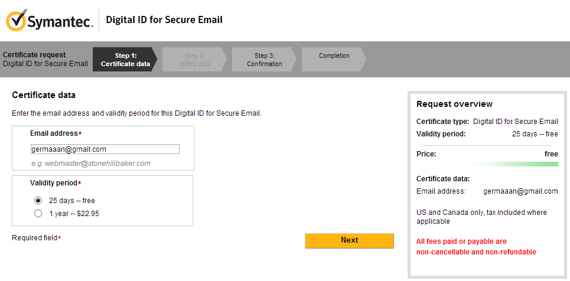

Una vez que completados todos los pasos, recibiremos un correo electrónico confirmando la operación con una contraseña que deberemos introducir para acceder a la página de descarga de nuestro certificado. Finalmente para obtenerlo, solo tendremos que dar la orden de generarlo desde dicha página y, cuando esté listo, tendremos la opción de instalarlo.

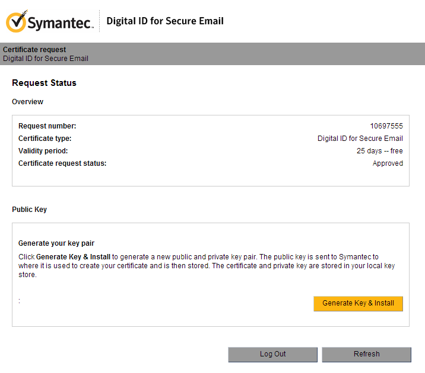

Como lo hemos instalado en el navegador Google Chrome, comprobamos que se ha instalado correctamente desde “Configuración -> Mostrar opciones avanzadas -> Administrar certificados…”. Vemos que tenemos nuestro certificado emitido por Symantec, como vamos a necesitar el archivo del certificado para cifrar y firmar correos electrónicos, seleccionamos nuestro certificado y pulsamos el botón “Exportar” para obtenerlo, seleccionando durante el proceso que queremos “Exportar la clave privada” también.

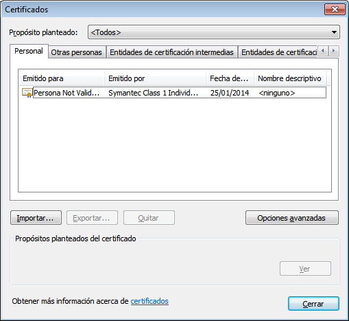

Ahora queremos hacer un ejemplo de cifrado y firmado de correo electrónico con dicho certificado, para ello vamos a usar el cliente de correo Mozilla Thunderbird. Lo primero que tenemos que hacer es añadir nuestra cuenta de correo, configurándola para que funcione con POP3.

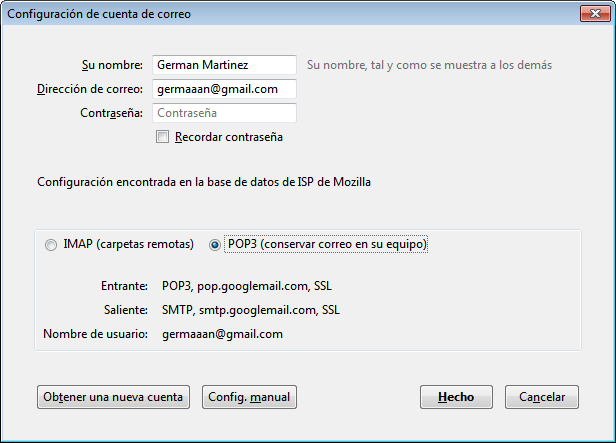

Tenemos que importar nuestro archivo de certificado, así que desde la configuración de nuestra cuenta, en el apartado “Seguridad”, pulsamos el botón “Ver certificado” de la sección “Certificados”, accederemos al “Administrador de certificados” y pulsando el botón “Importar” podremos importar el archivo de nuestro certificado.

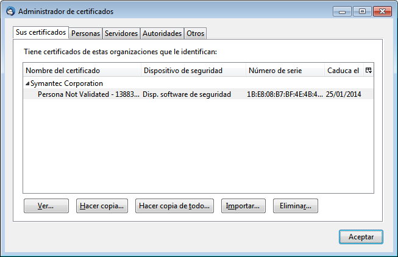

Solo nos queda indicar que vamos a usar dicho certificado tanto para firmar digitalmente como para cifrar los mensajes, pulsando el botón “Seleccionar” y seleccionando el certificado que acabamos de importar.

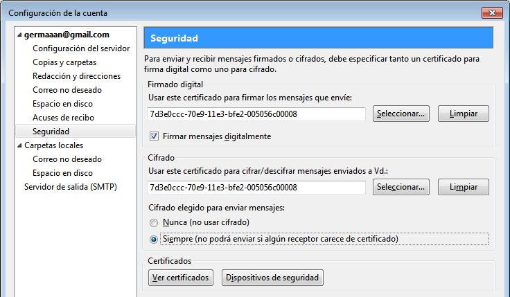

Cuando vayamos a enviar un nuevo mensaje, comprobamos que si pulsamos la marca junto al botón “Seguridad”, tanto la opción “Cifrar este mensaje” como la opción “Firmar digitalmente este mensaje” están marcadas. Además, también vamos a mandar un segundo correo en el que no vamos a usar ni firma digital ni cifrado, para buscar diferencias entre ambos.

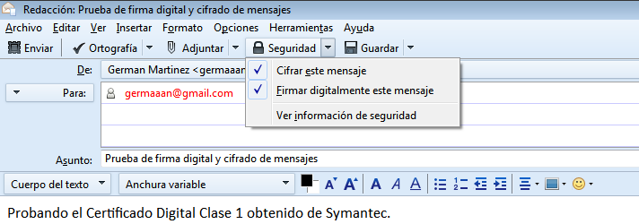

Vamos a comparar los 2 mensajes enviados, uno firmado digitalmente y cifrado y el otro no. Lo primero que salta a la vista son los iconos que se muestran en el mensaje firmado y cifrado, que en el otro correo no aparecen; además, si hacemos clic sobre alguno de los iconos obtendremos más información sobre el firmado y cifrado del mensaje.

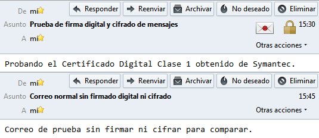

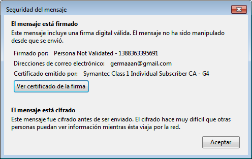

La última comprobación que podemos hacer es ver el código fuente del mensaje, donde se ve claramente que un mensaje está cifrado y el otro no. En el correo cifrado, vemos que la cabecera contiene “Content-Type:  application/pkcs7-mime;  name="smime.p7m";  smime- type=enveloped-data”, lo que indica que ha sido cifrado mediante S/MIM (un estándar de cifrado de clave pública y firma de datos MIME); pero en el mensaje no cifrado vemos que ese mismo campo tiene el valor “Content-Type: text/plain; charset=ISO-8859-1; format=flowed”, que indica que el contenido es texto plano sin firmar. Además, en la siguiente imagen se puede ver como internamente un mensaje es leíble a simple vista y el otro no:

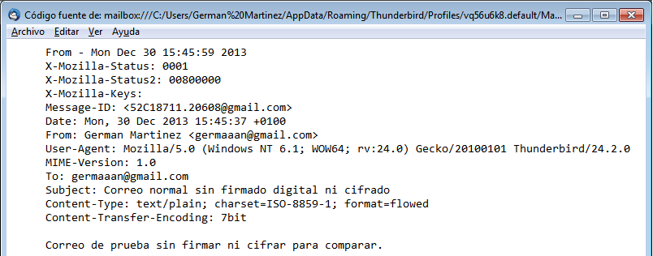

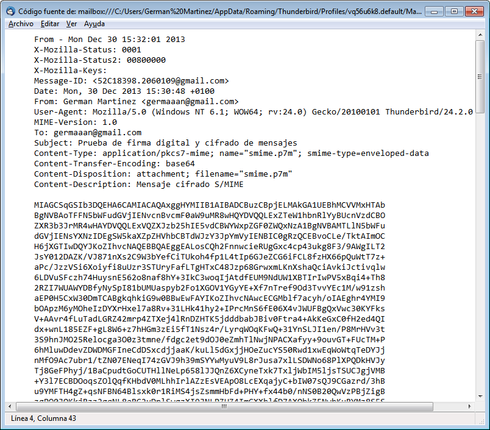


## 10. Navegación segura mediante certificados SSL.
### a. Montar un servidor Apache (puedes hacerlo desde algunos programas que ya lo incluyen como XAMP, EasyPHP y otros que instalan Apache, PHP y MySQL).

Voy a montar un servidor Apache en un sistema operativo Ubuntu 13.10, se puede instalar introduciendo en un terminal el comando `sudo apt-get install apache2`:

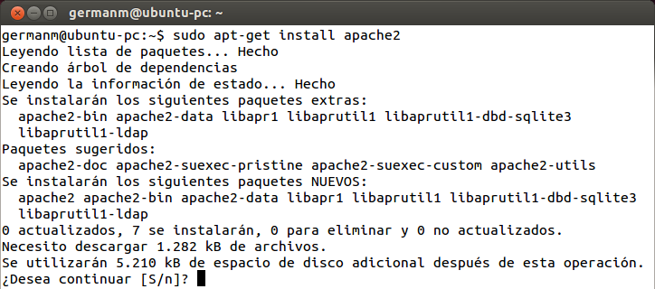

### b. Obtener un CSR (Certificate Signing Request, será la “huella dactilar” de nuestro servidor), lo cual puedes hacer con OpenSSL, por ejemplo, generando primero una pareja de llaves para el servidor, y luego el CSR para las llaves generadas anteriormente.

Para obtener nuestro CSR, primero tenemos que generar un archivo de llave privada RSA de 2048 bits, en mi caso dicho archivo se va a llamar “localhost.key” y se crea introduciendo en un terminal el comando “openssl genrsa -des3 -out localhost.key 2048”, dándole además una contraseña.

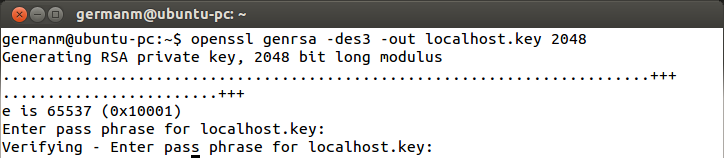

Ahora generamos el archivo CSR, que se llamará “localhost.csr” usando el archivo de llave privada que acabamos de crear. Lo hacemos introduciendo el comando `openssl req -new -key localhost.key -out localhost.csr`, indicando todos los valores requeridos a excepción de una dirección de correo electrónico, una contraseña de desafío y un nombre opcional para la compañía, además el nombre común debe ser un FQDN por lo que vamos a introducir “localhost.com” (si no hacemos todo así tendremos problemas a la hora de obtener el certificado SSL de VeriSign que es el que vamos a utilizar).

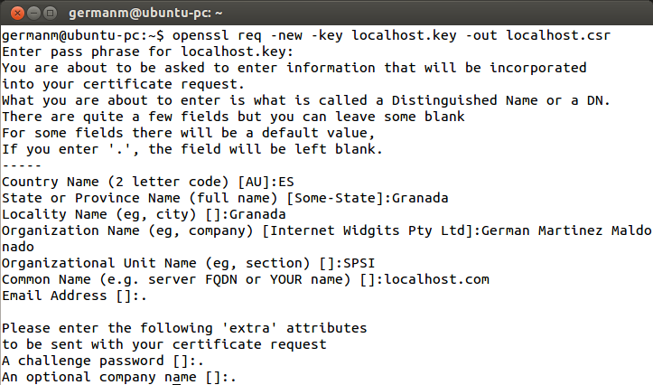

### c. Obtener un certificado SSL en modo de prueba de alguna CA (VeriSign, GlobalSign, Thawte…). En el proceso deberás de introducir el CSR generado antes. Seguir los pasos indicados.

Vamos a obtener un certificado SSL de prueba de VeriSign, lo podemos conseguir desde la dirección “[https:/ trustcenter.websecurity.symantec.com/process/retail/trial_initial?application_locale=VRSN_US&inid=vrsn_symc_ssl_Try](https:/ trustcenter.websecurity.symantec.com/process/retail/trial_initial?application_locale=VRSN_US&inid=vrsn_symc_ssl_Try)”. Para obtener este certificado SSL de prueba, que será válido durante 30 días, tenemos que introducir nuestros datos en la primera página de registro y cuando pasemos a la siguiente, introducir el contenido completo del archivo CSR que hemos generado en el paso anterior. Una vez completemos todos los pasos, recibiremos en nuestro correo la confirmación de que Symantec (empresa a la que pertenece VeriSign) ha aprobado nuestra solicitud de un certificado SSL de prueba, además de proporcionarnos enlaces donde nos explican los pasos a seguir para instalar tanto el “Secure Site Trial Root CA Certificate” como el “Trial SSL Intermediate CA Certificate”.

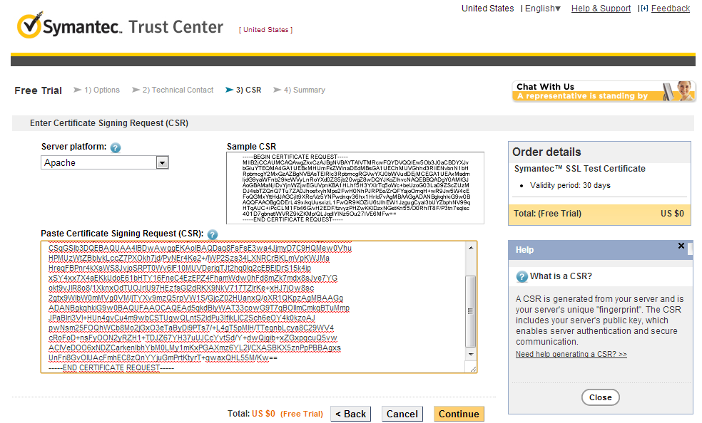

### d. Instalar el certificado SSL obtenido en Apache.

El certificado SSL lo recibiremos en el correo de confirmación al que hacíamos referencia en el punto anterior, así que creamos en nuestra carpeta personal un archivo llamado “public.crt” y en su interior copiamos el certificado que habremos recibido por correo.

### e. Instalar el certificado de la CA que expide nuestro certificado SSL en el navegador para poder enlazar la cadena de confianza y permitir la navegación segura. Este es un certificado de tipo intermedio, especial para la emisión de certificados SSL de prueba, que a su vez se certifica con el Certificado CA Root, o con un certificado Trial Root especial de prueba, que será, eventualmente, también necesario instalar en nuestro navegador si no es distribuido con el mismo.

Vamos a descargarnos más certificados que tenemos que instalar, primero el “Secure Site Trial Root CA Certificate”, que tenemos que instalarlo en cada uno de los navegadores con los que vayamos a acceder a las páginas web servidas por nuestro servidor usando SSL, para esto creamos en nuestra carpeta personal el archivo “trial.cer” y copiamos en su interior el certificado que nos indican en la página web.

En este caso voy a usar Firefox, por lo que una vez guardado el certificado, en el navegador accedemos a “Editar -> Preferencias -> Avanzado -> Certificados -> Ver certificados -> Autoridades” y pulsamos el botón “Importar” para añadir el certificado que acabamos de obtener, marcando la opción “Confiar en esta CA para identificar sitios web”.

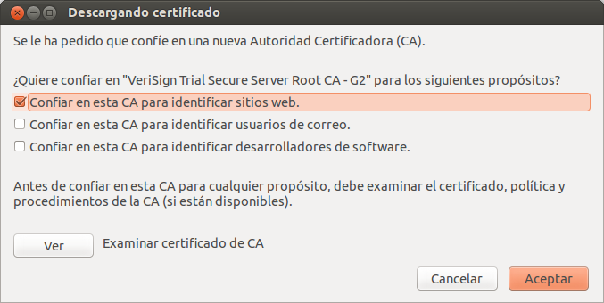

Ahora descargamos el “Trial SSL Intermediate CA Certificate”, que deberemos instalar en cada servidor que estemos probando. Para eso creamos en nuestra carpeta personal el archivo “intermediate.crt” y copiamos en su interior el certificado indicado en la página.

### f. Editar el archivo de configuración de Apache httpd.conf para indicarle los paths a nuestros certificados y llaves y activar SSL si esta no está ya activado.

Lo primero que tenemos que hacer es añadir al archivo “/etc/apache2/apache2.conf” la línea “ServerName localhost.com” (“localhost.com” fue el FQDN que indicamos cuando solicitamos el certificado SSL) y como nuestro servidor es local, en el archivo “/etc/hosts” y añadimos la línea “127.0.0.1 localhost.com” para que cuando vayamos a acceder a esa dirección, la solicitud sea servida por nuestro servidor local. Ahora, para poder usar SSL con Apache lo primero es activar el módulo SSL con “sudo a2enmod ssl” y reiniciar el servidor con `sudo service apache2 restart`.

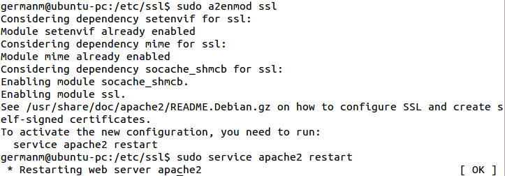

De los archivos que tenemos en nuestra carpeta personal, movemos los certificados (“public.crt” e “intermediate.crt”) a la carpeta “/etc/ssl/certs” y el archivo de clave privada (“localhost.key”) a la carpeta “/etc/ssl/private”. Ahora creamos un host virtual configurado para SSL que será sobre el que montemos nuestra página de ejemplo, indicándole la ruta de la misma, activando SSL para este sitio e indicándole donde están los archivos que acabamos de mover. Para todo lo descrito en el archivo “apache2.conf”, añadimos las siguientes líneas:

```
<VirtualHost 127.0.0.1:443>
    DocumentRoot /var/www/pruebaSSL
    ServerName localhost.com
    SSLEngine on
    SSLCertificateFile /etc/ssl/certs/public.crt
    SSLCertificateKeyFile /etc/ssl/private/localhost.key
    SSLCertificateChainFile /etc/ssl/certs/intermediate.crt
</VirtualHost>
```

Ahora para crear la página web, creamos primero el directorio “/var/www/pruebaSSL” y en su interior el archivo “index.html”. Para aplicar todas las configuraciones, reiniciamos Apache como en ocasiones anteriores, pero como ahora detectará la nueva configuración SSL, nos pedirá la contraseña de la clave privada de nuestro sitio “localhost.com”.

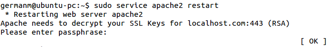

### g. Montar una página web de prueba con dirección localhost (127.0.0.1), y acceder a ella con protocolo SSL mediante el certificado instalado.

Para comprobar que nuestro sitio está funcionando con el protocolo SSL mediante los certificados instalados simplemente tenemos que introducir la dirección https://localhost.com, el icono del candado que aparece en la barra de direcciones indica que la conexión con este sitio web es segura y, si pulsamos en él, vemos que la conexión está verificada por “VeriSign, Inc.”

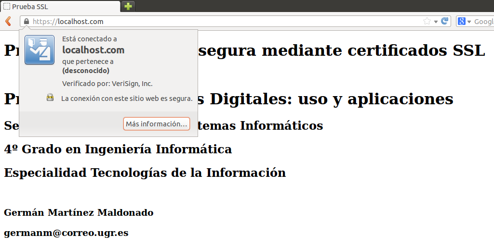

Si  pulsamos  el  botón  “Más  información…”,  veremos  información  más  detallada  de  la conexión, lo mismo que del certificado si pulsamos el botón “Ver certificado”.

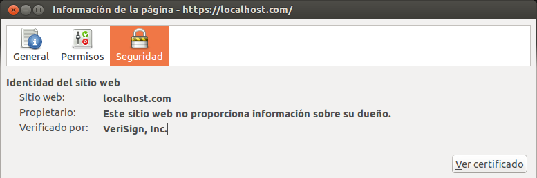

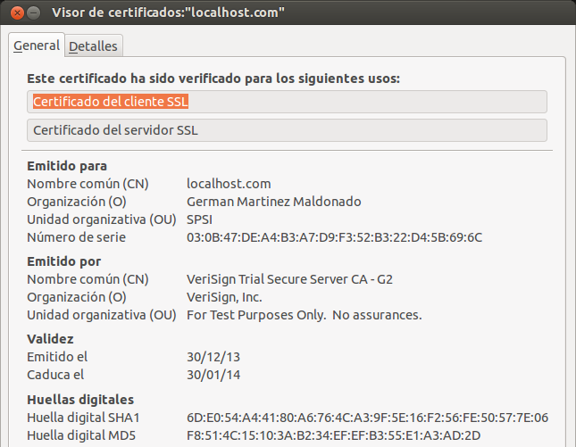

### h. Instalar un certificado EV-SSL, y realizar la navegación con él.

## 11. Aplicaciones para navegación segura.

### Ejecutar alguna aplicación de certificados digitales a través de servicios provistos por Internet: Sello de Tiempos, Notarización, etc. He aquí algunas páginas a las que poder acudir, ya que todas ellas o son públicas o proveen de ofertas de prueba gratuitas (lista sólo indicativa, escoger si se desea cualquier otro servicio):

### d. [https://www.universign.eu/en/](https://www.universign.eu/en/) en sus modalidades de firma electrónica y sello de tiempos conjuntamente.

Universign es una plataforma dedicada al campo de la firma electrónica y el sellado de tiempo con valor probatorio, registrándonos en su página web obtenemos una prueba gratuita consistente en 5 firmas electrónica y 5 marcas de tiempo.

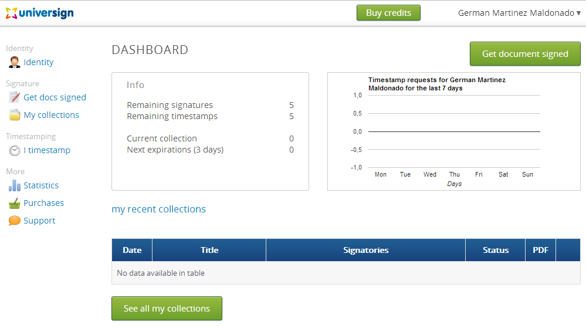

Para firmar un documento, simplemente tenemos que pulsar en “Get docs signed” y seleccionar el documento PDF a firmar:

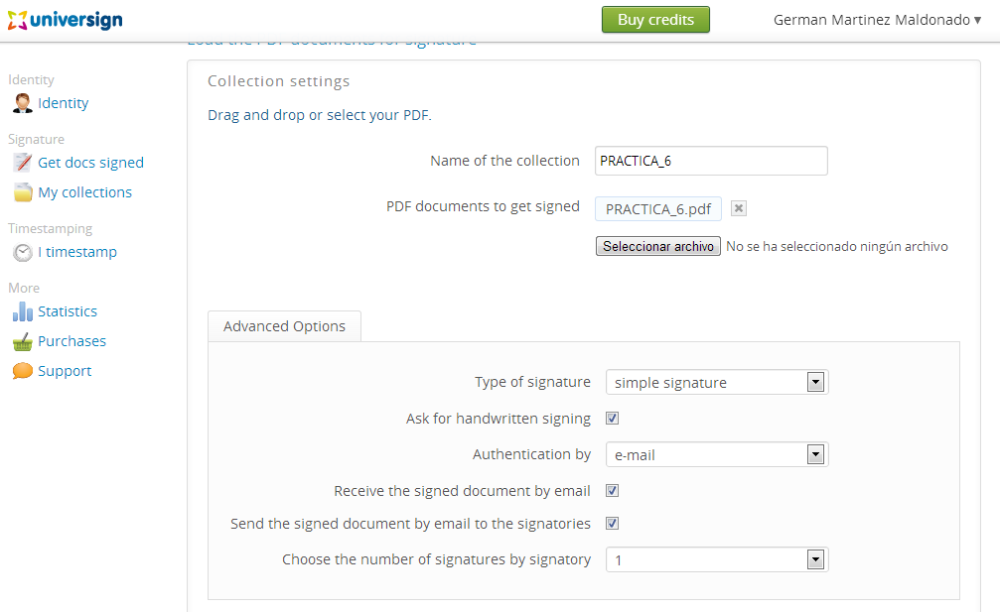

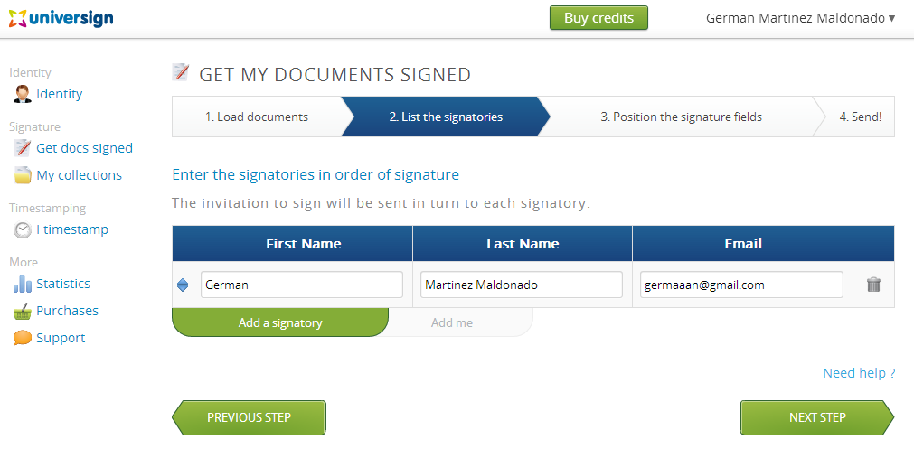

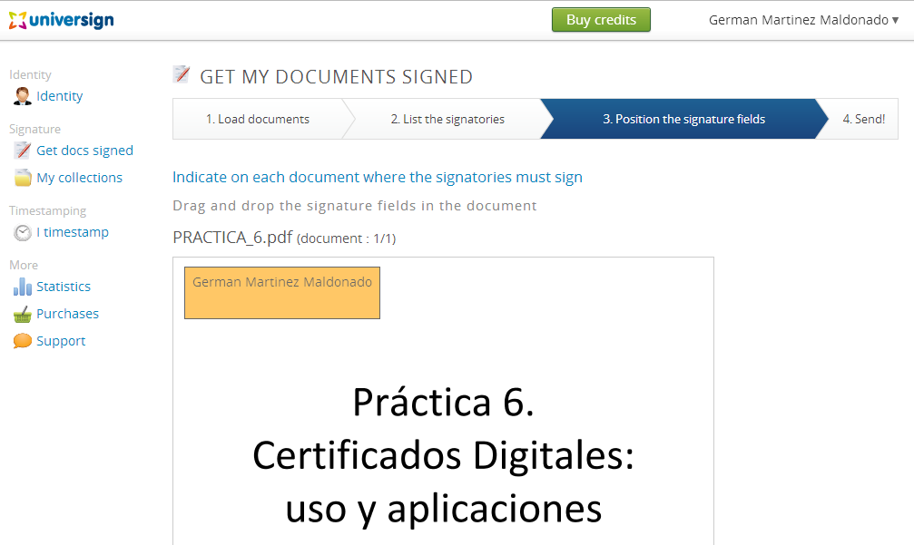

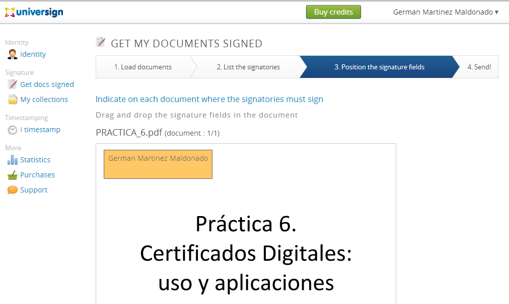

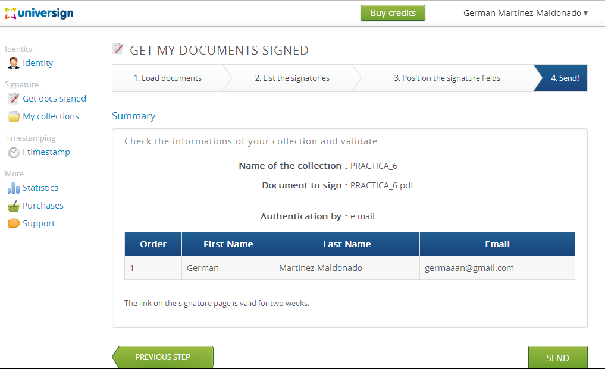

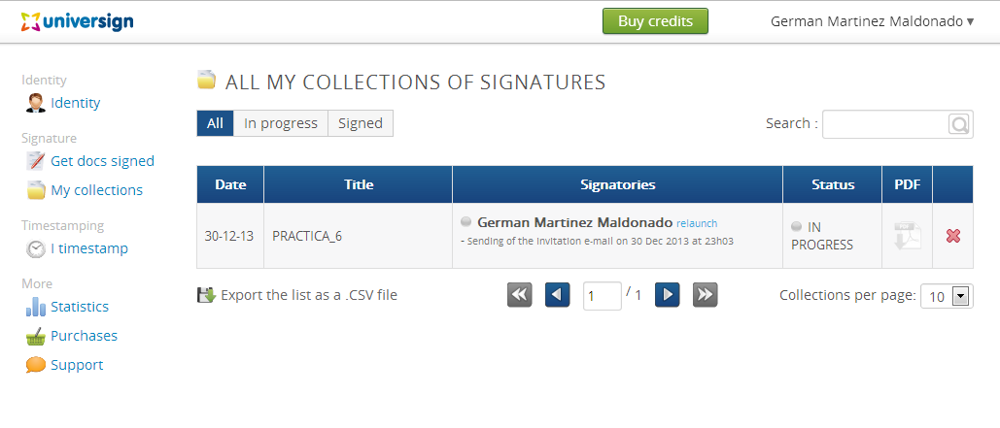

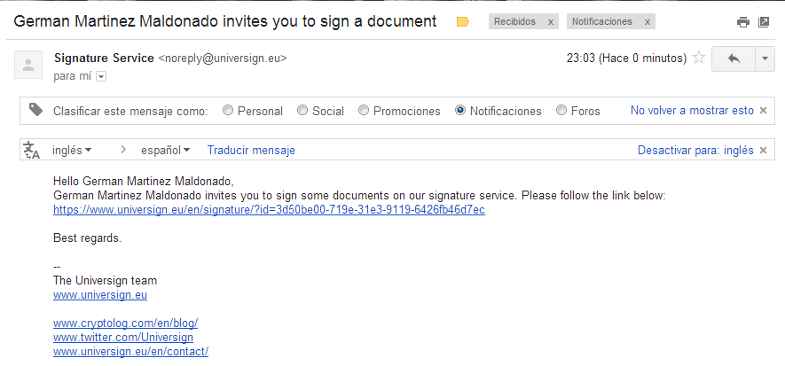

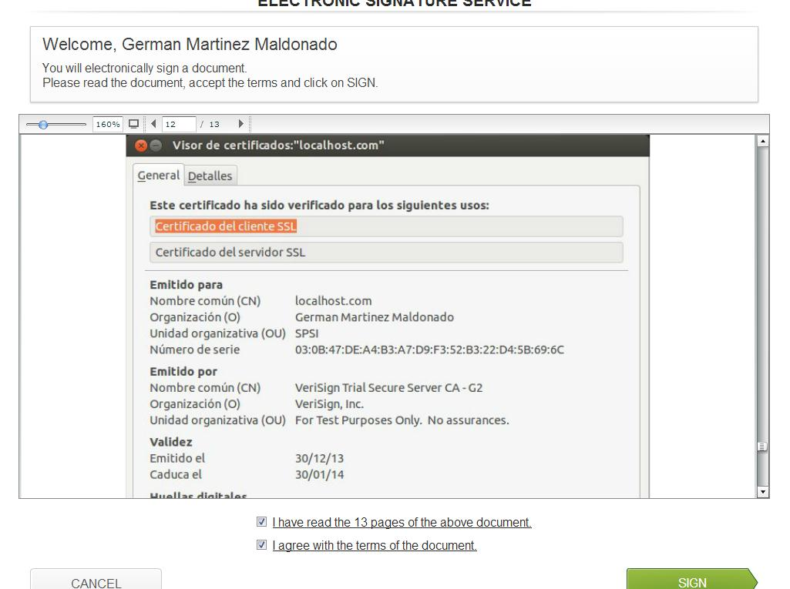

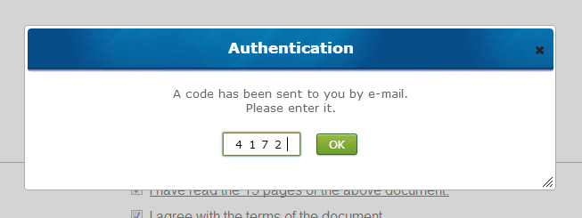

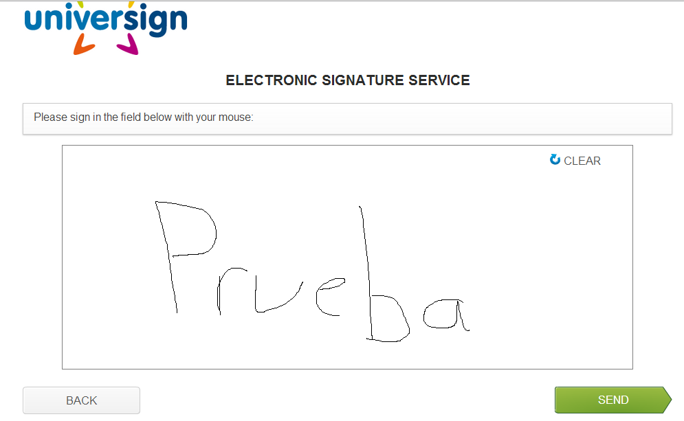

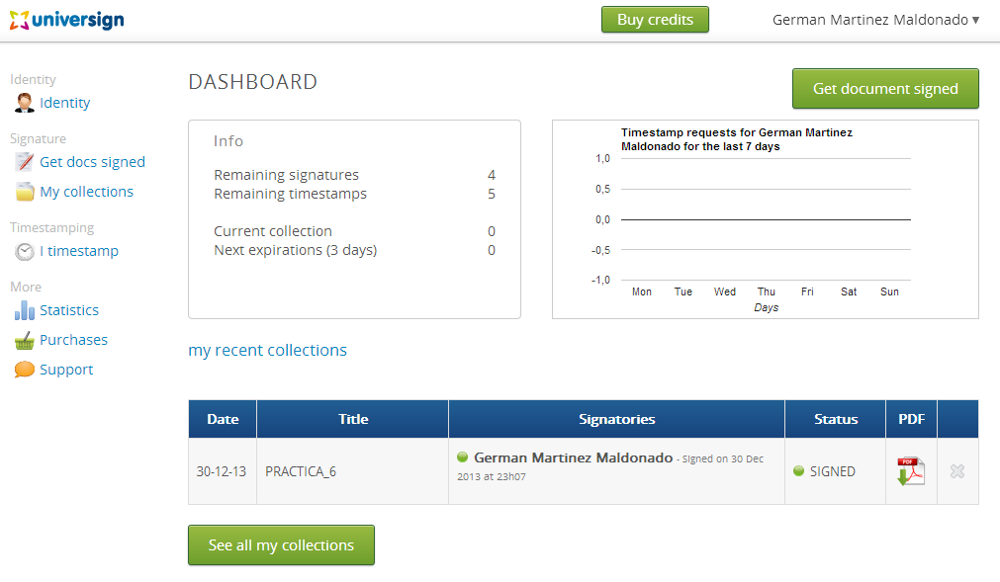

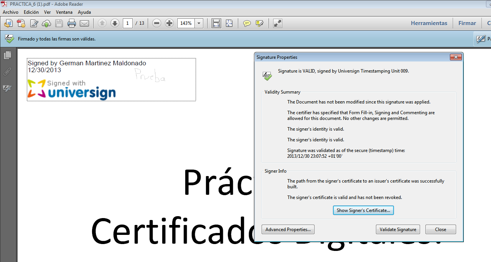

Marca de tiempo con java:


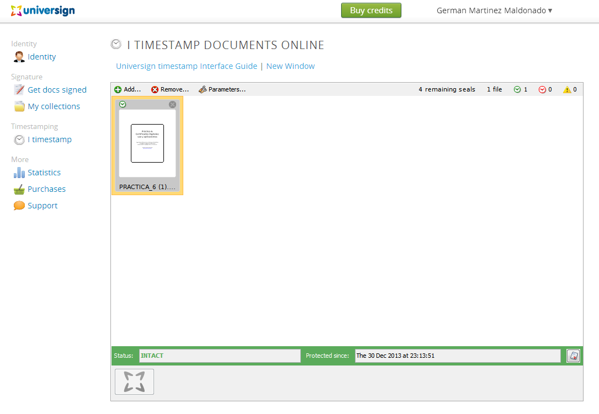

PRACTICA_6 (1).pdf.ers

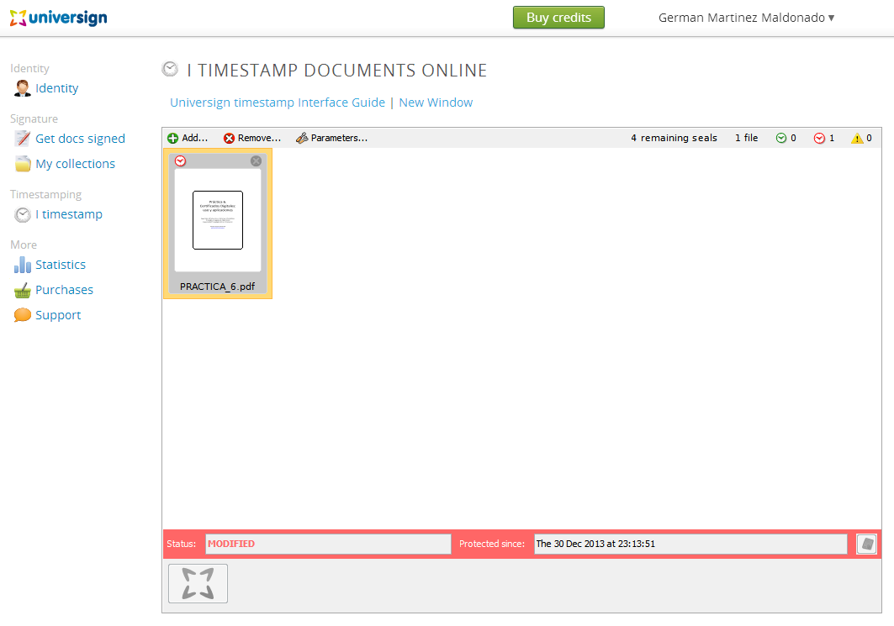
