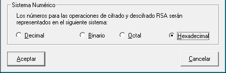
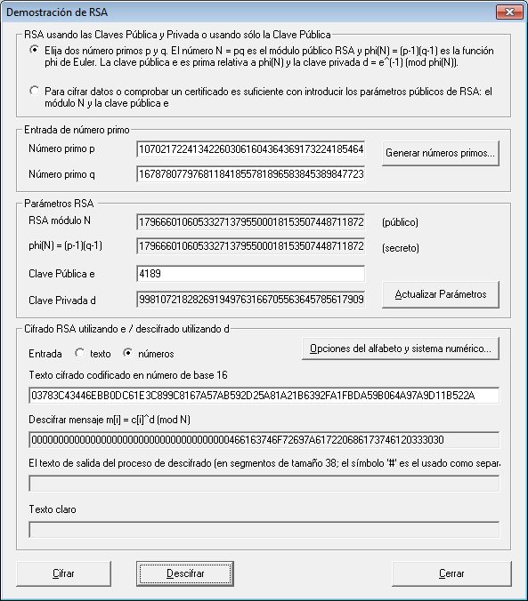
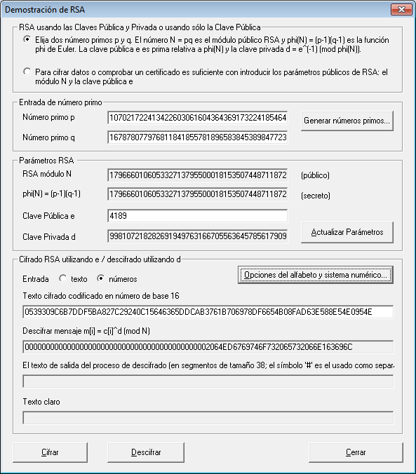
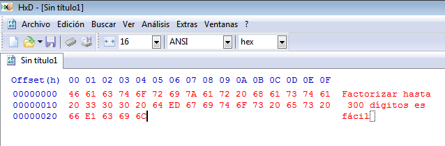

Seguridad y Protección de Sistemas Informáticos
===============================================
4º Grado en Ingeniería Informática 2013/2014
--------------------------------------------


# RSA
### Germán Martínez Maldonado

Vamos a atacar el sistema RSA usado por un dispositivo de cifrado que tiene una clave pública con los valores:

* N = 05833211A5664F63237531AC9B780DE857028E7E65B71783FD7324AF61740F508AE57EC2CB4AA1
* e = 105D

N está expresado en valor hexadecimal y tiene 78 cifras, por lo que no sería muy costoso realizar un ataque por factorización de N, así obtenemos los números primos p y q que lo componen, valores necesarios para sacar la clave secreta en conjunto con el exponente e que ya conocemos.

Para factorizar N vamos a utilizar Msieve ([http://sourceforge.net/projects/msieve/](http://sourceforge.net/projects/msieve/)), un software que ya hemos usado anteriormente para factorizar números enteros largos, además de gran utilidad en este caso ya que permite operar directamente con valores tanto decimales como octales como hexadecimales. Ejecutamos la aplicación desde línea de comandos indicándole que el valor es un valor hexadecimal incluyendo **“0x”** antes de dicho parámetro, la ejecución generará las siguientes entradas en el archivo de registro:

```
msieve151.exe         0x05833211A5664F63237531AC9B780DE857028E7E65B71783FD7324AF61740F508AE57EC2CB4AA1 Sat Dec 21 23:10:41 2013 Msieve v. 1.51 (SVN 845)

Sat Dec 21 23:10:41 2013 random seeds: e5f891c8 f15f1e74
Sat Dec 21 23:10:41 2013 factoring
179666010605332713795500018153507448711872430237104822626865712268822022470630646293675592353 (93 digits)
Sat Dec 21 23:10:41 2013 searching for 15-digit factors
Sat Dec 21 23:10:41 2013 commencing quadratic sieve (93-digit input) Sat Dec 21 23:10:42 2013 using multiplier of 1
Sat Dec 21 23:10:42 2013 using generic 32kb sieve core
Sat Dec 21 23:10:42 2013 sieve interval: 36 blocks of size 32768
Sat Dec 21 23:10:42 2013 processing polynomials in batches of 6
Sat Dec 21 23:10:42 2013 using a sieve bound of 1878979 (70588 primes)
Sat Dec 21 23:10:42 2013 using large prime bound of 219840543 (27 bits)
Sat Dec 21 23:10:42 2013 using double large prime bound of 1037036426091003 (42-50 bits)
Sat Dec 21 23:10:42 2013 using trial factoring cutoff of 50 bits
Sat Dec 21 23:10:42 2013 polynomial 'A' values have 12 factors
Sat Dec 21 23:10:42 2013 restarting with 182 full and 8754 partial relations
Sun Dec 22 00:38:38 2013 70829 relations (17804 full + 53025 combined from 927454 partial), need 70684
Sun Dec 22 00:38:39 2013 begin with 945258 relations
Sun Dec 22 00:38:40 2013 reduce to 180656 relations in 10 passes
Sun Dec 22 00:38:40 2013 attempting to read 180656 relations
Sun Dec 22 00:38:40 2013 recovered 180656 relations
Sun Dec 22 00:38:40 2013 recovered 161481 polynomials
Sun Dec 22 00:38:41 2013 attempting to build 70829 cycles
Sun Dec 22 00:38:41 2013 found 70829 cycles in 6 passes
Sun Dec 22 00:38:41 2013 distribution of cycle lengths:
Sun Dec 22 00:38:41 2013	length 1 : 17804
Sun Dec 22 00:38:41 2013	length 2 : 12919
Sun Dec 22 00:38:41 2013	length 3 : 12007
Sun Dec 22 00:38:41 2013	length 4 : 9498
Sun Dec 22 00:38:41 2013	length 5 : 6909
Sun Dec 22 00:38:41 2013	length 6 : 4807
Sun Dec 22 00:38:41 2013	length 7 : 2980
Sun Dec 22 00:38:41 2013	length 9+: 3905
Sun Dec 22 00:38:41 2013 largest cycle: 22 relations
Sun Dec 22 00:38:41 2013 matrix is 70588 x 70829 (17.6 MB) with weight 4320225 (61.00/col)
Sun Dec 22 00:38:41 2013 sparse part has weight 4320225 (61.00/col)
Sun Dec 22 00:38:41 2013 filtering completed in 3 passes
Sun Dec 22 00:38:41 2013 matrix is 66952 x 67016 (16.7 MB) with weight 4104010 (61.24/col)
Sun Dec 22 00:38:41 2013 sparse part has weight 4104010 (61.24/col)
Sun Dec 22 00:38:41 2013 saving the first 48 matrix rows for later
Sun Dec 22 00:38:41 2013 matrix includes 64 packed rows
Sun Dec 22 00:38:41 2013 matrix is 66904 x 67016 (9.9 MB) with weight 3173380 (47.35/col)
Sun Dec 22 00:38:41 2013 sparse part has weight 2199669 (32.82/col)
Sun Dec 22 00:38:41 2013 using block size 26761 for processor cache size 3072 kB
Sun Dec 22 00:38:42 2013 commencing Lanczos iteration
Sun Dec 22 00:38:42 2013 memory use: 6.9 MB
Sun Dec 22 00:38:50 2013 linear algebra at 71.9%, ETA 0h 0m
Sun Dec 22 00:38:53 2013 lanczos halted after 1060 iterations (dim = 66900)
Sun Dec 22 00:38:53 2013 recovered 14 nontrivial dependencies
Sun Dec 22 00:38:53 2013 prp43 factor: 1070217224134226030616043643691732241854641
Sun Dec 22 00:38:53 2013 prp51 factor: 167878077976811841855781896583845389847723336021233
Sun Dec 22 00:38:53 2013 elapsed time 01:28:12
```

Como se indica al final, la factorización del número ha tardado 1 hora 28 minutos y 12 segundos, siendo los números p y q los valores 1070217224134226030616043643691732241854641 y 167878077976811841855781896583845389847723336021233.

Para obtener la clave secreta y descifrar el mensaje vamos a usar CrypTool ([https://www.cryptool.org/en/](https://www.cryptool.org/en/)), otro software que ya hemos usado anteriormente y que sirve para realizar diversos procedimientos criptográficos. Desde el menú **“Cifrar/Descifrar -> Asimétrico -> RSA Demostración…”** accedemos a una interfaz en la que primero seleccionamos en la parte superior que vamos a usar claves públicas y privadas (primera opción); en la sección **“Entrada de número primo”** introducimos los números primos p y q obtenidos con Msieve; ahora, en la sección **“Parámetros RSA”** en **“Clave Pública e”** introducimos el valor del exponente e que conocíamos junto con el valor N (el valor hexadecimal 105D que convertimos a valor decimal 4189); una vez hecho esto, el programa automáticamente nos generará la clave secreta en **“Clave Privada d”**, que en este caso será:

94786794804914131651481270021306149833668584343147998107218282691949763166705563645785617909

Ya solo nos falta descifrar los dos bloques cifrados, primero pulsamos el botón **“Opciones del alfabeto y sistema numérico...”** e indicamos en la sección más inferior que el sistema numérico a usar para la representación de valores es hexadecimal:



Seleccionamos que la entrada va a ser números e introducimos los bloques cifrados:

* C1 = 03783C43446EBB0DC61E3C899C8167A57AB592D25A81A21B6392FA1FBDA59B064A97A9D11B522A
* C2 = 0539309C6B7DDF5BA827C29240C15646365DDCAB3761B706978DF6654B08FAD63E588E54E0954E





Una  vez  descifrados  ambos  bloques,  como  resultado  tenemos  que  C1  descifrado  es **“466163746F72697A617220686173746120333030”** y que C2 descifrado es **“2064ED6769746F732065732066E163696C”**. Ambas cadenas están en hexadecimal, por lo que para conocer su significado vamos a usar un editor hexadecimal como es HxD ([http://mh-nexus.de/en/hxd/](http://mh-nexus.de/en/hxd/)). Introducimos los valores hexadecimales en el editor y observamos:



El mensaje transmitido es **“Factorizar hasta 300 dígitos es fácil”**.
